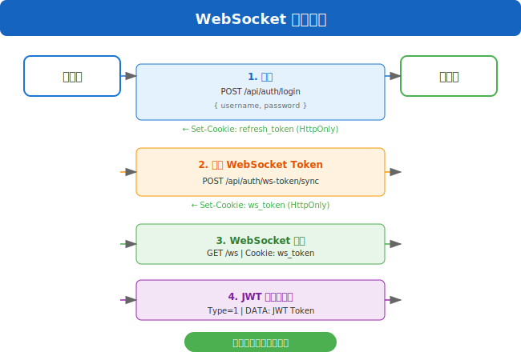
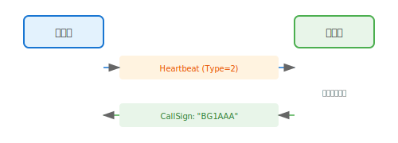
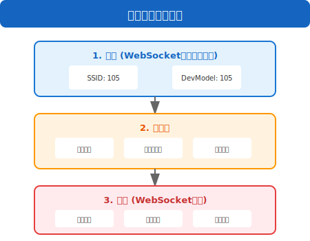

# WebSocket 协议详解

## 概述

DraARL 的 WebSocket 服务用于浏览器客户端（幽灵设备）的实时通信，支持语音收发、文本消息和设备状态同步。

## 连接端点

```
ws://server:port/ws
wss://server:port/ws  (HTTPS环境)
```

## 认证机制

### 认证流程

WebSocket 使用 HttpOnly Cookie 进行认证，不支持 URL query 传 token。



### Cookie 配置

| Cookie名 | Path | HttpOnly | Secure | 过期时间 |
|-----------|------|----------|--------|----------|
| `ws_token` | `/` | Yes | Yes(HTTPS) | 3小时 |
| `refresh_token` | `/api/auth` | Yes | Yes(HTTPS) | 14天 |

### 互斥检查

同一用户同一平台（SSID 105）只允许一个在线的 WebSocket 连接。新连接会踢掉旧连接。

## 消息格式

所有 WebSocket 消息使用 DraARLv1 二进制帧格式。

### 帧结构

```
+--------+--------+--------+--------+--------+--------+--------+--------+
| 0-3    | 4-5    | 6-37   | 38-47  | 48     | 49     | 50     | 51-53  |
| Ver    | Length |Username|DevPass | Type   |DevModel| SSID   | DMRID  |
| 4B     | 2B     | 32B    | 10B    | 1B     | 1B     | 1B     | 3B     |
+--------+--------+--------+--------+--------+--------+--------+--------+
| 54-85  | 86-89  | 90+                                              |
|CallSign| Rsv    | DATA                                             |
| 32B    | 4B     | 变长                                             |
+--------+--------+--------+-------------------------------------------------+

固定头部：90 字节
```

### 消息类型

| Type | 值 | 说明 | 方向 |
|------|-----|------|------|
| Control | 0 | 控制指令 | 双向 |
| JWTAuth | 1 | JWT认证 | 客户端→服务器 |
| Heartbeat | 2 | 心跳 | 客户端→服务器 |
| Config | 3 | 设备配置 | 双向 |
| TextMessage | 4 | 文本消息 | 双向 |
| Opus16K | 5 | Opus语音 | 双向 |
| ServerVoice | 6 | 服务器互联语音 | 服务器→客户端 |

## 语音通信

### Opus 编码参数

| 参数 | 值 | 说明 |
|------|-----|------|
| 采样率 | 16000 Hz | 16kHz 宽带 |
| 声道数 | 1 | 单声道 |
| 帧时长 | 60 ms | 每帧60ms |
| 每帧采样数 | 960 | 16000 × 0.06 |
| 比特率 | 16-32 kbps | VOIP模式 |

### 合并帧格式

WebSocket 客户端采用 2 帧合并发送策略，每 120ms 发送一个数据包。

```
+-------------+-------------+-------------+-------------+
| Frame1 Len  | Frame1 Data | Frame2 Len  | Frame2 Data |
| 2B          | N bytes     | 2B          | M bytes     |
+-------------+-------------+-------------+-------------+

Frame Len: 大端序 uint16，表示对应帧的字节长度
```

### 语音发送流程

```javascript
// 1. 获取麦克风权限
const stream = await navigator.mediaDevices.getUserMedia({ audio: true });

// 2. 创建 AudioContext 和 ScriptProcessor
const audioContext = new AudioContext({ sampleRate: 16000 });
const processor = audioContext.createScriptProcessor(960, 1, 1);

// 3. Opus 编码 (使用 opus-recorder 等库)
// 每 60ms 产生一个 Opus 帧

// 4. 合并 2 帧 (120ms)
const mergedFrame = mergeFrames([frame1, frame2]);

// 5. 构建 DraARLv1 包
const packet = buildPacket({
  type: 5,  // TypeOpus16K
  devModel: 105,  // Browser
  ssid: 105,
  data: mergedFrame
});

// 6. 发送
ws.send(packet);
```

### 语音接收流程

```javascript
ws.onmessage = (event) => {
  const buffer = event.data;
  const packet = decodePacket(buffer);

  switch (packet.type) {
    case 5:  // TypeOpus16K
      // 1. 解析合并帧
      const frames = parseMergedFrames(packet.data);

      // 2. Opus 解码
      for (const frame of frames) {
        const pcm = opusDecode(frame);
        // 3. 播放
        playAudio(pcm);
      }
      break;

    case 4:  // TypeTextMessage
      // 显示文本消息
      showMessage(packet.data);
      break;
  }
};
```

## 文本消息

### 发送文本消息

```javascript
const textEncoder = new TextEncoder();
const textBytes = textEncoder.encode("你好世界");

// 构建 DATA: [Flags(1B)] + [Text(UTF-8)]
const data = new Uint8Array(1 + textBytes.length);
data[0] = 0x00;  // Flags: 普通消息
data.set(textBytes, 1);

const packet = buildPacket({
  type: 4,  // TypeTextMessage
  devModel: 105,
  ssid: 105,
  data: data
});

ws.send(packet);
```

### 接收文本消息

```javascript
function handleTextMessage(data) {
  const flags = data[0];
  const textBytes = data.slice(1);
  const text = new TextDecoder().decode(textBytes);

  const isUrgent = (flags & 0x01) !== 0;
  const isSystem = (flags & 0x02) !== 0;

  if (isSystem) {
    showSystemMessage(text, isUrgent);
  } else {
    showUserMessage(text, isUrgent);
  }
}
```

## 心跳机制

### 心跳发送

WebSocket 客户端需要定期发送心跳包保持连接。

```javascript
// 每 25 秒发送一次心跳
setInterval(() => {
  const packet = buildPacket({
    type: 2,  // TypeHeartbeat
    devModel: 105,
    ssid: 105,
    data: new Uint8Array(0)  // 无GPS数据
  });
  ws.send(packet);
}, 25000);
```

### 心跳响应

服务器收到心跳后会返回响应，更新 CallSign 等信息。



## 连接状态管理

### 连接状态

| 状态 | 说明 |
|------|------|
| Connecting | 正在连接 |
| Connected | 已连接，未认证 |
| Authenticated | 已认证，可通信 |
| Reconnecting | 断线重连中 |
| Disconnected | 已断开 |

### 重连策略

```javascript
class WSConnection {
  constructor() {
    this.reconnectAttempts = 0;
    this.maxReconnectAttempts = 10;
    this.baseDelay = 1000;  // 1秒
  }

  reconnect() {
    if (this.reconnectAttempts >= this.maxReconnectAttempts) {
      console.error('Max reconnect attempts reached');
      return;
    }

    const delay = this.baseDelay * Math.pow(2, this.reconnectAttempts);
    this.reconnectAttempts++;

    setTimeout(() => {
      this.connect();
    }, delay);
  }

  onOpen() {
    this.reconnectAttempts = 0;
  }
}
```

### Ping/Pong 机制

```
客户端                           服务器
   │                                │
   │  Ping (每25秒)                │
   │───────────────────────────────>│
   │                                │
   │  Pong                          │
   │<───────────────────────────────│
   │                                │
   
超时: 10秒无Pong响应，断开连接
```

## 幽灵设备管理

### 幽灵设备生命周期



### 群组切换

```javascript
// 切换幽灵设备群组
async function switchGroup(groupId) {
  const response = await fetch('/api/radio/group', {
    method: 'PUT',
    headers: {
      'Authorization': `Bearer ${token}`,
      'Content-Type': 'application/json'
    },
    body: JSON.stringify({ group_id: groupId })
  });

  if (response.ok) {
    currentGroup = groupId;
    // 服务器会自动更新幽灵设备的群组
  }
}
```

## 错误处理

### 常见错误

| 错误码 | 说明 | 处理方式 |
|--------|------|----------|
| 4001 | 认证失败 | 重新登录获取token |
| 4002 | Token过期 | 刷新token |
| 4003 | 同账号冲突 | 关闭其他页面连接 |
| 4004 | 群组不存在 | 切换到有效群组 |
| 5001 | 服务器错误 | 重连 |

### 错误消息格式

```json
{
  "type": "error",
  "code": 4001,
  "message": "Authentication failed"
}
```

## 完整示例

### JavaScript 客户端示例

```javascript
class DraARLClient {
  constructor(serverUrl) {
    this.serverUrl = serverUrl;
    this.ws = null;
    this.audioContext = null;
    this.opusEncoder = null;
    this.opusDecoder = null;
  }

  async connect(token) {
    // 同步 ws_token Cookie
    await fetch('/api/auth/ws-token/sync', {
      method: 'POST',
      headers: { 'Authorization': `Bearer ${token}` }
    });

    // 建立 WebSocket 连接
    this.ws = new WebSocket(`${this.serverUrl}/ws`);
    this.ws.binaryType = 'arraybuffer';

    this.ws.onopen = () => {
      console.log('WebSocket connected');
      this.sendAuth(token);
      this.startHeartbeat();
    };

    this.ws.onmessage = (event) => {
      this.handleMessage(event.data);
    };

    this.ws.onclose = () => {
      console.log('WebSocket disconnected');
      this.reconnect();
    };
  }

  sendAuth(token) {
    const tokenBytes = new TextEncoder().encode(token);
    const packet = this.buildPacket(1, 105, 105, tokenBytes);
    this.ws.send(packet);
  }

  startHeartbeat() {
    setInterval(() => {
      const packet = this.buildPacket(2, 105, 105, new Uint8Array(0));
      this.ws.send(packet);
    }, 25000);
  }

  sendVoice(opusFrame) {
    // 合并2帧
    const merged = this.mergeFrames([opusFrame, opusFrame]);
    const packet = this.buildPacket(5, 105, 105, merged);
    this.ws.send(packet);
  }

  sendText(text) {
    const textBytes = new TextEncoder().encode(text);
    const data = new Uint8Array(1 + textBytes.length);
    data[0] = 0x00;
    data.set(textBytes, 1);
    const packet = this.buildPacket(4, 105, 105, data);
    this.ws.send(packet);
  }

  buildPacket(type, devModel, ssid, data) {
    const header = new Uint8Array(90);
    // Version: "DraA"
    header.set([0x44, 0x72, 0x61, 0x41], 0);
    // Length
    const length = 90 + data.length;
    header[4] = (length >> 8) & 0xFF;
    header[5] = length & 0xFF;
    // Type
    header[48] = type;
    // DevModel
    header[49] = devModel;
    // SSID
    header[50] = ssid;

    const packet = new Uint8Array(length);
    packet.set(header);
    packet.set(data, 90);
    return packet;
  }

  handleMessage(buffer) {
    const packet = new Uint8Array(buffer);
    const type = packet[48];
    const data = packet.slice(90);

    switch (type) {
      case 1:  // JWT Auth Response
        this.handleAuthResponse(data);
        break;
      case 4:  // Text Message
        this.handleTextMessage(data);
        break;
      case 5:  // Opus Voice
        this.handleVoice(data);
        break;
    }
  }
}
```

## 性能优化

### 语音延迟优化

| 优化项 | 优化前 | 优化后 |
|--------|--------|--------|
| 帧时长 | 20ms | 60ms |
| 发送间隔 | 20ms | 120ms |
| 每秒发包数 | 50 | ~8.3 |
| 头部开销占比 | 50-80% | ~25-35% |
| 额外延迟 | - | +100ms |

### 网络优化

1. **合并帧**: 减少网络包数量
2. **异步写通道**: 避免音频写入与Ping竞争
3. **分片锁**: 减少锁竞争
4. **RCU模式**: 读无锁，写时复制

## 安全考虑

1. **Origin检查**: 验证WebSocket请求来源
2. **Token安全**: 使用HttpOnly Cookie，防止XSS
3. **互斥连接**: 防止多开攻击
4. **限流**: 防止消息洪水
5. **输入校验**: 验证消息格式和长度
