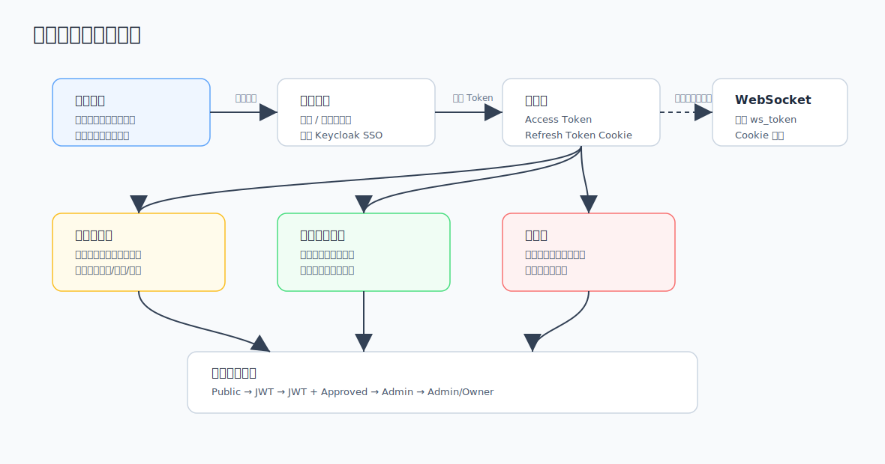

# 02. 账号、登录与权限

## 1. 权限分层



| 权限层级 | 含义 |
|---|---|
| `Public` | 无需登录。 |
| `JWT` | 需要登录，并携带有效 access token。 |
| `JWT + Approved` | 需要登录且账号审核通过；管理员通常可绕过。 |
| `Admin` | 管理员。 |
| `Admin/Owner` | 管理员或资源所有者，例如群主。 |

用户审核状态：

| `approval_status` | 含义 |
|---:|---|
| `0` | 待审核。 |
| `1` | 已通过。 |
| `2` | 已拒绝。 |

当前角色字段为单角色系统，主要值为 `user` 或 `admin`。

## 2. 公共访问

公共导航包含：

- 首页 `/`
- 中继查询 `/relays`
- 工具 `/tools`
- 技术交流 `/forum`
- 文档 `/docs`
- 关于 `/about`
- 登录 `/login`
- 注册 `/register`

首页提供登录和注册入口；中继查询可按省/市查询公开中继台信息；工具页提供 BLE 设备预配置入口；论坛和关于页面当前为占位内容。

> 截图占位：首页。建议展示顶部导航、站点 Logo/名称、登录/注册入口。
>
> 截图占位：中继查询页。建议展示地区选择、查询按钮和结果表格。

## 3. 注册流程

注册流程由站点配置决定是否强制邮箱验证。

推荐流程：

1. 访问 `/register`。
2. 填写用户名、密码、邮箱、昵称、呼号等信息。
3. 如果开启邮箱验证，先获取图片验证码，再发送邮箱验证码。
4. 输入邮箱验证码后提交注册。
5. 注册成功后账号进入待审核状态。
6. 管理员审核通过后，用户可使用设备、群组、在线收发等核心功能。

> 截图占位：注册页。建议展示账号信息、邮箱验证码和提交按钮。

相关 API：

| Method | Path | Auth | 说明 |
|---|---|---|---|
| GET | `/api/captcha` | Public | 获取图片验证码。 |
| POST | `/api/auth/send-code` | Public | 发送邮箱验证码。 |
| POST | `/api/auth/verify-email` | Public | 注册邮箱验证码校验。 |
| POST | `/api/auth/register` | Public | 注册。 |

## 4. 登录方式

登录页支持：

- 账号/邮箱 + 密码登录。
- 邮箱验证码登录。
- Keycloak SSO 登录，启用 SSO 时显示。
- 忘记密码。

登录成功后，前端会：

- 将 access token 写入 `localStorage.token`。
- 将用户信息写入 `localStorage.user`。
- 调用 `/api/auth/ws-token/sync` 同步 WebSocket 所需的 `ws_token` Cookie。
- refresh token 由后端通过 HttpOnly Cookie 管理，也会在响应数据中返回以兼容非浏览器客户端。

> 截图占位：登录页。建议展示密码登录、验证码登录和 SSO 按钮。

相关 API：

| Method | Path | Auth | 说明 |
|---|---|---|---|
| POST | `/api/auth/login` | Public | 账号密码登录。 |
| POST | `/api/auth/email-login` | Public | 邮箱验证码登录。 |
| POST | `/api/auth/refresh` | Public | 刷新 access token。 |
| POST | `/api/auth/logout` | Public | 登出并清 Cookie。 |
| POST | `/api/auth/ws-token/sync` | JWT | 同步 `ws_token` Cookie。 |
| POST | `/api/auth/ws-token/clear` | Public | 清理 `ws_token`。 |

## 5. Token 与 Cookie

### Access Token

受保护接口使用：

```http
Authorization: Bearer <access_token>
```

access token 默认有效期为 3 小时。

### Refresh Token

浏览器推荐使用 HttpOnly Cookie：

- Cookie 名：`refresh_token`
- Path：`/api/auth`
- 过期：14 天

非浏览器客户端可在 `POST /api/auth/refresh` body 中传 `refresh_token`。

### WebSocket Token

WebSocket 使用 HttpOnly Cookie：

- Cookie 名：`ws_token`
- Path：`/`

`/ws` 只从 Cookie 读取 token，不支持 URL query 传 token。

## 6. SSO 绑定

如果启用 Keycloak，用户可以通过 SSO 登录，也可以在个人中心绑定或解绑 SSO。

相关 API：

| Method | Path | Auth | 说明 |
|---|---|---|---|
| GET | `/api/sso/login` | Public | 获取 SSO 登录 URL。 |
| GET | `/api/sso/callback` | Public | SSO 回调。 |
| POST | `/api/sso/exchange` | Public | 一次性交换码换 token。 |
| GET | `/api/sso/status` | JWT | 当前用户 SSO 绑定状态。 |
| POST | `/api/sso/bind` | JWT | 发起 SSO 绑定。 |
| DELETE | `/api/sso/unbind` | JWT | 解绑 SSO。 |

## 7. 用户审批和操作证审批

注册成功后，普通用户通常处于待审核状态。待审核用户可访问仪表盘和个人中心，但不能访问需要审核通过的核心功能。

操作证用于认证用户呼号。呼号不能直接通过个人资料接口修改，需要提交操作证或呼号变更申请，管理员审批通过后生效。

相关 API：

| Method | Path | Auth | 说明 |
|---|---|---|---|
| GET | `/api/approvals/pending` | Admin | 用户审批列表。 |
| PUT | `/api/approvals/:id/approve` | Admin | 用户审批。 |
| GET | `/api/certificate-approvals` | Admin | 操作证审批列表。 |
| PUT | `/api/operator-certificates/:id/approve` | Admin | 操作证审批。 |

