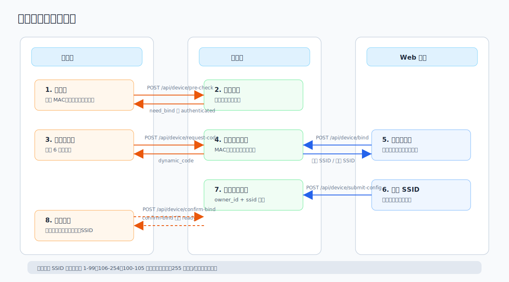

# 04. 设备与群组

## 1. 设备动态码绑定

设备绑定采用动态码流程，分设备端和 Web 端两部分。

设备端流程：

1. 调用 `POST /api/device/pre-check`，提交 MAC、用户名、设备密码。
2. 如果返回 `need_bind`，调用 `POST /api/device/request-code` 获取动态码。
3. 设备屏幕或串口显示动态码。
4. 轮询 `POST /api/device/confirm-bind` 等待用户完成绑定。

Web 端流程：

1. 用户登录且审核通过。
2. 进入设备管理，输入设备动态码。
3. 调用 `POST /api/device/bind` 绑定设备。
4. 选择或确认 SSID。
5. 调用 `POST /api/device/submit-config` 提交设备配置。
6. 设备端轮询确认后获得用户名、设备密码、SSID、DMR ID 等信息。

> 截图占位：设备动态码绑定对话框。建议展示动态码输入、推荐 SSID、可替换设备列表。

相关 API：

| Method | Path | Auth | 说明 |
|---|---|---|---|
| POST | `/api/device/pre-check` | Public | 设备预检查。 |
| POST | `/api/device/request-code` | Public | 请求动态码。 |
| POST | `/api/device/confirm-bind` | Public | 轮询绑定状态。 |
| POST | `/api/device/bind` | JWT | Web 端绑定设备。 |
| POST | `/api/device/submit-config` | JWT | 提交绑定配置。 |

## 2. SSID 规则

| 范围 | 含义 |
|---|---|
| `1-99` | 普通设备可用。 |
| `100-105` | 幽灵设备保留，普通设备不可分配。 |
| `106-254` | 普通设备可用。 |
| `255` | 系统/历史特殊保留。 |

普通设备运行时唯一键为 `owner_id + ssid`。同一用户同一 SSID 同时只允许一台普通设备在线。

## 3. 设备型号

| DevModel | 名称 | 说明 |
|---:|---|---|
| `0` | 未知设备 | 历史/默认值。 |
| `1` | ESP32 链路盒子（1W 射频版） | 支持频率设置和固件升级。 |
| `2` | ESP32 链路盒子（无射频版） | 支持系统/平台设置和固件升级。 |
| `100` | 微信小程序 | 幽灵/保留段。 |
| `101` | Android 客户端 | UDP 幽灵设备。 |
| `102` | iOS 客户端 | UDP 幽灵设备。 |
| `103` | Windows 客户端 | UDP 幽灵设备。 |
| `104` | macOS 客户端 | UDP 幽灵设备，预留。 |
| `105` | 浏览器客户端 | WebSocket 幽灵设备。 |
| `106` | 互联设备（历史） | 兼容显示。 |
| `107` | ESP32 链路台/手咪（历史） | 兼容显示。 |
| `236` | 南山对讲软件桥接器 | 软件桥接器。 |
| `237` | 涛涛对讲软件桥接器 | 软件桥接器。 |
| `238` | 本视对讲（HT）软件桥接器 | 软件桥接器。 |
| `239` | NRL2 系统软件桥接器 | 软件桥接器。 |

## 4. 设备管理

设备管理 `/devices` 仅审核通过用户可见。普通用户看到自己的设备，管理员后台可查看全局设备。

常见操作：

- 查看设备列表、在线状态、型号、SSID、所属群组、最近上线 IP。
- 修改设备名称、群组、优先级、备注。
- 设置设备级禁发/禁收。
- 删除设备。
- 进入设备参数配置。
- 下发配置同步。

设备级禁发/禁收通过 `PUT /api/devices/:id` 的 `disable_send`、`disable_recv` 字段维护。群组不再提供群组级收发控制。

> 截图占位：设备管理页。建议展示设备列表、在线状态、设置按钮、禁发/禁收状态。

相关 API：

| Method | Path | Auth | 说明 |
|---|---|---|---|
| GET | `/api/devices` | JWT+Approved | 设备列表。 |
| GET | `/api/device/get` | JWT+Approved | 设备详情。 |
| GET | `/api/device/qths` | JWT+Approved | 设备位置列表。 |
| PUT | `/api/devices/:id` | JWT+Approved | 更新设备。 |
| DELETE | `/api/devices/:id` | JWT+Approved | 删除设备。 |
| PUT | `/api/devices/:id/group` | JWT+Approved | 切换设备群组。 |

## 5. 设备配置同步

配置同步用于 UDP 普通设备。配置内容包括频率、亚音、静噪、电源档位、RF 保护等参数。

常见配置键：

- `rx_freq` / `tx_freq`
- `rx_tone_mode` / `rx_tone_value`
- `tx_tone_mode` / `tx_tone_value`
- `sql_level`
- `power_level`
- `rf_guard_enabled`
- `rf_guard_single_tx_limit_s`
- `rf_guard_window_s`
- `rf_guard_max_tx_in_window_s`

> 截图占位：设备参数配置窗口。建议展示频率设置、系统设置、平台设置和同步按钮。

相关 API：

| Method | Path | Auth | 说明 |
|---|---|---|---|
| GET | `/api/devices/:id/config` | JWT+Approved | 读取设备配置。 |
| PUT | `/api/devices/:id/config` | JWT+Approved | 保存设备配置。 |
| POST | `/api/devices/:id/config/sync` | JWT+Approved | 下发设备配置。 |
| GET | `/api/admin/devices/:id/config` | Admin | 管理员读取任意设备配置。 |
| PUT | `/api/admin/devices/:id/config` | Admin | 管理员更新任意设备配置。 |
| POST | `/api/admin/devices/:id/config/sync` | Admin | 管理员同步任意设备配置。 |

## 6. 群组管理

群组管理 `/groups` 仅审核通过用户可见。

群组类型：

| 类型 | 说明 |
|---|---|
| 公开群组 | 所有审核通过用户可见，通常无需密码。 |
| 私有群组 | 需要密码加入，已加入用户可访问。 |
| 虚拟互联组 | 管理员后台创建，用于关联多个目标群组实现互联。 |

普通用户常见操作：

- 查看公开群组。
- 查看已加入的私有群组。
- 创建群组。
- 搜索群组。
- 输入密码加入私有群组。
- 离开私有群组。
- 群主可编辑/删除自己创建的群组。
- 群主可踢出群组设备。

> 截图占位：我的群组页。建议展示公开群组、已加入私有群组、创建/加入/退出入口。

相关 API：

| Method | Path | Auth | 说明 |
|---|---|---|---|
| GET | `/api/groups` | JWT+Approved | 群组列表。 |
| GET | `/api/groups/:id` | JWT+Approved | 群组详情。 |
| GET | `/api/groups/:id/devices` | JWT+Approved | 群组设备列表。 |
| POST | `/api/groups` | JWT+Approved | 创建群组。 |
| POST | `/api/groups/search` | JWT+Approved | 搜索群组。 |
| POST | `/api/groups/:id/join` | JWT+Approved | 加入私有群组。 |
| GET | `/api/groups/:id/members` | JWT+Approved | 群组成员。 |
| POST | `/api/groups/:id/leave` | JWT+Approved | 退出群组。 |
| PUT | `/api/groups/:id` | Admin/Owner | 更新群组。 |
| DELETE | `/api/groups/:id` | Admin/Owner | 删除群组。 |
| DELETE | `/api/groups/:id/devices/:deviceId` | Admin/Owner | 踢出设备。 |

