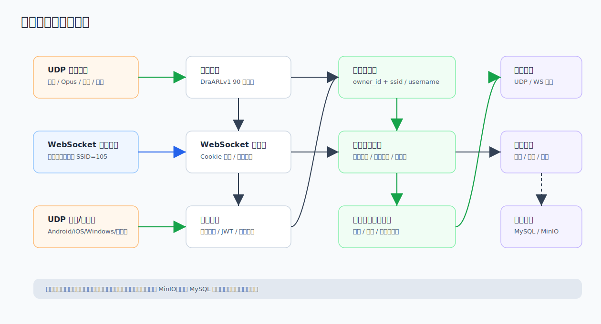

# 05. 在线收发、通信记录与通联日志

## 1. 实时通信运行态



语音与文本进入同一群组路由。后端根据设备状态、群组、禁发/禁收、半双工状态决定是否转发，并可按站点配置记录音频和统计信息。

## 2. 在线收发

在线收发 `/radio` 使用浏览器 WebSocket 幽灵设备，固定 SSID 为 `105`。

功能：

- 自动连接 `/ws`。
- 选择当前群组。
- PTT 语音发射。
- 文本消息发送。
- 播放群组内语音消息。
- 展示当前发言人。
- 展示连接状态。
- 检查同账号多页面连接冲突。

使用注意：

- 页面需要麦克风和音频播放权限。
- 同一账号同平台幽灵设备只允许一个在线连接。
- 浏览器在线收发依赖 `ws_token` HttpOnly Cookie，不能在 URL 里传 token。
- 语音输入模式下可按住 PTT 或空格键说话。

> 截图占位：在线收发页。建议展示群组选择、连接状态、消息列表、PTT 按钮和文本输入模式。

相关 API：

| Method | Path | Auth | 说明 |
|---|---|---|---|
| GET | `/api/radio/config` | JWT+Approved | 在线收发配置。 |
| GET | `/api/radio/status` | JWT+Approved | 幽灵设备状态。 |
| GET | `/api/radio/groups/stats` | JWT+Approved | 群组实时统计。 |
| GET | `/api/radio/groups/:id/devices` | JWT+Approved | 群组在线设备。 |
| PUT | `/api/radio/group` | JWT+Approved | 切换幽灵设备群组。 |
| GET | `/api/radio/conflict` | JWT+Approved | 幽灵连接冲突检查。 |
| GET | `/ws` | Cookie(ws_token) | WebSocket 实时通联。 |

## 3. WebSocket 消息

WebSocket 只接受二进制消息，消息体遵循 DraARLv1 帧格式。

常用包类型：

| Type | 说明 |
|---:|---|
| `2` | 心跳。 |
| `4` | 文本消息。 |
| `5` | Opus 16K 语音。 |

示例：

```javascript
const ws = new WebSocket('wss://server.example.com/ws');
ws.binaryType = 'arraybuffer';
```

认证依赖 Cookie，无需也不能在 URL 中附加 token。

## 4. 通信记录

通信记录页面分为：

- 平台发信记录：`/comm-records/platform`
- 后台全局记录：`/admin/comm-records/platform`

普通用户只能查看自己设备相关记录；管理员可在后台查看全局记录。

通信记录字段包括：

- 设备 ID、设备名称、设备型号。
- 群组 ID、群组名称。
- 开始时间、结束时间、持续时长。
- 音频文件 URL。
- 状态和统计字段。

> 截图占位：通信记录页。建议展示筛选条件、记录表格、音频下载入口。

相关 API：

| Method | Path | Auth | 说明 |
|---|---|---|---|
| GET | `/api/comm-records` | JWT | 通信记录列表。 |
| GET | `/api/comm-records/:id` | JWT | 通信记录详情。 |
| GET | `/api/comm-records/user-stats` | JWT | 当前用户通信统计。 |
| GET | `/api/comm-records/user-trend` | JWT | 当前用户通信趋势。 |
| DELETE | `/api/comm-records/:id` | Admin | 删除通信记录。 |
| GET | `/api/comm-records/system-stats` | Admin | 系统通信统计。 |
| GET | `/api/comm-records/system-trend` | Admin | 系统通信趋势。 |

## 5. 通信记录策略

管理员可在站点配置中设置音频记录策略：

- 是否启用音频记录。
- 数据保留天数。
- 最小录制阈值。
- 最大录制时长。
- 批量上传间隔。

如果启用音频记录，音频数据会上传到 MinIO，索引和统计信息写入数据库。

相关 API：

| Method | Path | Auth | 说明 |
|---|---|---|---|
| GET | `/api/config/comm-settings` | Admin | 读取通信设置。 |
| PUT | `/api/config/comm-settings` | Admin | 更新通信设置。 |

## 6. 通联日志

通联日志用于记录业余无线电 QSO 信息。用户可维护自己的记录，管理员可在后台管理所有记录。

字段包括：

- 我方呼号。
- UTC 时间。
- 发射/接收频率。
- CQ/ITU 分区。
- 通信模式。
- 对方呼号。
- 双方信号报告。
- 双方功率。
- QTH。
- 电台和天线。
- 备注。

电台预设可保存常用的电台、天线、功率、QTH，并在新增日志时快速填充。

> 截图占位：通联日志页。建议展示列表、筛选、新增/编辑表单和电台预设管理。

相关 API：

| Method | Path | Auth | 说明 |
|---|---|---|---|
| GET | `/api/logbooks` | JWT | 我的通联日志列表。 |
| GET | `/api/logbooks/:id` | JWT | 我的通联日志详情。 |
| POST | `/api/logbooks` | JWT | 创建通联日志。 |
| PUT | `/api/logbooks/:id` | JWT | 更新通联日志。 |
| DELETE | `/api/logbooks/:id` | JWT | 删除通联日志。 |
| DELETE | `/api/logbooks/batch` | JWT | 批量删除通联日志。 |
| GET | `/api/admin/logbooks` | Admin | 管理员日志列表。 |
| PUT | `/api/admin/logbooks/:id` | Admin | 管理员更新日志。 |

## 7. 电台预设

电台预设用于通联日志快速填充。

相关 API：

| Method | Path | Auth | 说明 |
|---|---|---|---|
| GET | `/api/user/radio-presets` | JWT | 获取预设。 |
| POST | `/api/user/radio-presets` | JWT | 创建预设。 |
| PUT | `/api/user/radio-presets/:id` | JWT | 更新预设。 |
| DELETE | `/api/user/radio-presets/:id` | JWT | 删除预设。 |
| PUT | `/api/user/radio-presets/reorder` | JWT | 重排预设。 |

