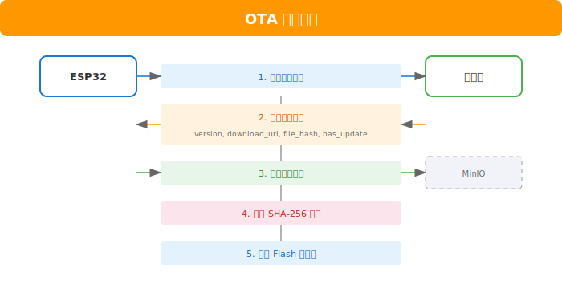
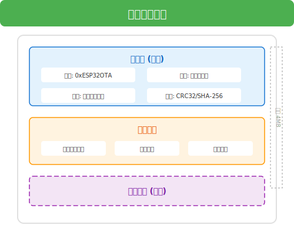

# 固件与 OTA 升级

## 概述

DraARL 支持 ESP32 设备的固件远程升级（OTA），管理员可上传固件文件，设备可查询并下载最新固件进行升级。

## 支持的设备型号

| DevModel | 名称 | 支持OTA |
|----------|------|---------|
| 1 | ESP32 链路盒子（1W 射频版） | ✓ |
| 2 | ESP32 链路盒子（无射频版） | ✓ |
| 107 | ESP32 链路台/手咪（历史型号） | ✓ |

## 固件管理

### 上传固件

管理员可通过后台上传固件文件到 MinIO。

**接口**: `POST /api/firmware`

**请求**:
```http
POST /api/firmware
Authorization: Bearer <admin_token>
Content-Type: multipart/form-data

------boundary
Content-Disposition: form-data; name="file"; filename="firmware.bin"

<二进制固件数据>
------boundary
Content-Disposition: form-data; name="dev_model"

1
------boundary
Content-Disposition: form-data; name="version"

1.2.3
------boundary
Content-Disposition: form-data; name="changelog"

- 修复音频卡顿问题
- 优化功耗管理
------
```

**参数说明**:

| 参数 | 类型 | 必需 | 说明 |
|------|------|------|------|
| file | File | 是 | 固件文件（.bin） |
| dev_model | int | 是 | 设备型号（1或2） |
| version | string | 是 | 版本号（semver格式：x.y.z） |
| changelog | string | 否 | 更新日志 |

**响应**:
```json
{
  "code": 200,
  "message": "固件上传成功",
  "data": {
    "id": 1,
    "dev_model": 1,
    "version": "1.2.3",
    "file_name": "firmware.bin",
    "file_size": 1048576,
    "file_hash": "sha256:abc123...",
    "is_latest": true,
    "created_at": "2026-05-30 12:00:00"
  }
}
```

### 获取固件列表

**接口**: `GET /api/firmware`

**权限**: Admin

**响应**:
```json
{
  "code": 200,
  "data": [
    {
      "id": 2,
      "dev_model": 1,
      "version": "1.2.3",
      "changelog": "- 修复音频卡顿问题",
      "file_name": "firmware.bin",
      "file_size": 1048576,
      "file_hash": "sha256:abc123...",
      "is_latest": true,
      "created_at": "2026-05-30 12:00:00"
    },
    {
      "id": 1,
      "dev_model": 1,
      "version": "1.2.2",
      "changelog": "- 初始版本",
      "file_name": "firmware_v1.2.2.bin",
      "file_size": 1024000,
      "file_hash": "sha256:def456...",
      "is_latest": false,
      "created_at": "2026-05-28 10:00:00"
    }
  ]
}
```

### 删除固件

**接口**: `DELETE /api/firmware/:id`

**权限**: Admin

**响应**:
```json
{
  "code": 200,
  "message": "固件删除成功"
}
```

## 设备端 OTA 流程

### 查询最新固件

设备可通过公开接口查询指定型号的最新固件。

**接口**: `GET /api/public/firmware/latest`

**参数**:

| 参数 | 类型 | 必需 | 说明 |
|------|------|------|------|
| dev_model | int | 是 | 设备型号 |
| current_version | string | 否 | 当前版本（用于比较） |

**请求示例**:
```http
GET /api/public/firmware/latest?dev_model=1&current_version=1.2.2
```

**响应**:
```json
{
  "code": 200,
  "data": {
    "id": 2,
    "dev_model": 1,
    "version": "1.2.3",
    "changelog": "- 修复音频卡顿问题\n- 优化功耗管理",
    "file_name": "firmware.bin",
    "file_size": 1048576,
    "file_hash": "sha256:abc123...",
    "download_url": "https://oss.example.com/draarl/firmware/1/1.2.3/firmware.bin",
    "has_update": true
  }
}
```

**响应字段说明**:

| 字段 | 说明 |
|------|------|
| download_url | 固件下载URL（MinIO预签名URL，有效期1小时） |
| has_update | 是否有更新（与current_version比较） |
| file_hash | SHA-256校验哈希，用于验证固件完整性 |

### OTA 升级流程



### ESP32 OTA 示例代码

```cpp
#include <WiFi.h>
#include <HTTPClient.h>
#include <Update.h>

void checkAndUpdateFirmware() {
    HTTPClient http;
    String url = "https://server.example.com/api/public/firmware/latest";
    url += "?dev_model=1";
    url += "&current_version=" + String(FIRMWARE_VERSION);
    
    http.begin(url);
    int httpCode = http.GET();
    
    if (httpCode == 200) {
        String payload = http.getString();
        // 解析JSON
        DynamicJsonDocument doc(1024);
        deserializeJson(doc, payload);
        
        bool hasUpdate = doc["data"]["has_update"];
        if (hasUpdate) {
            String downloadUrl = doc["data"]["download_url"];
            String expectedHash = doc["data"]["file_hash"];
            
            // 下载并更新
            performOTA(downloadUrl, expectedHash);
        }
    }
    http.end();
}

void performOTA(String url, String expectedHash) {
    HTTPClient http;
    http.begin(url);
    int httpCode = http.GET();
    
    if (httpCode == 200) {
        int contentLength = http.getSize();
        WiFiClient* stream = http.getStreamPtr();
        
        if (Update.begin(contentLength)) {
            size_t written = Update.writeStream(*stream);
            
            if (written == contentLength) {
                if (Update.end(true)) {
                    Serial.println("OTA Update Success");
                    ESP.restart();
                }
            }
        }
    }
    http.end();
}
```

## 固件版本管理

### 版本号规范

采用 [Semantic Versioning](https://semver.org/) 规范：

```
MAJOR.MINOR.PATCH

MAJOR: 不兼容的API变更
MINOR: 向后兼容的功能新增
PATCH: 向后兼容的问题修复
```

### 版本比较

服务器使用 semver 库进行版本比较，判断是否需要更新：

```
1.2.2 < 1.2.3  → has_update = true
1.2.3 = 1.2.3  → has_update = false
1.2.4 > 1.2.3  → has_update = false (降级不提示)
2.0.0 > 1.9.9  → has_update = false (大版本不自动提示)
```

### 最新版本标识

- 上传新固件时，自动将同型号旧版本的 `is_latest` 设为 `false`
- 新固件的 `is_latest` 设为 `true`
- 设备查询最新固件时，只返回 `is_latest = true` 的记录

## 固件文件规范

### 文件格式



### 文件大小限制

- 最大文件大小: 4MB（ESP32 Flash限制）
- 建议大小: < 2MB

### 校验机制

1. **SHA-256**: 服务器上传时自动计算，存储在数据库
2. **设备端验证**: 下载完成后计算SHA-256并与服务器返回值比较
3. **Flash验证**: 写入后读取验证

## 安全考虑

1. **HTTPS下载**: 固件下载必须使用HTTPS
2. **签名验证**: 建议对固件进行数字签名（可选）
3. **版本回滚保护**: 降级需要特殊处理
4. **断点续传**: 大文件支持断点续传
5. **超时处理**: 下载超时自动重试

## 故障排除

### 常见问题

| 问题 | 原因 | 解决方案 |
|------|------|----------|
| 查询无结果 | 设备型号错误 | 检查dev_model参数 |
| 下载失败 | 网络问题或URL过期 | 重新查询获取新URL |
| 哈希校验失败 | 文件损坏 | 重新下载 |
| 写入失败 | Flash空间不足 | 检查固件大小 |
| 升级后无法启动 | 固件不兼容 | 使用串口恢复 |

### 日志查看

设备端OTA日志可通过串口查看：

```
[OTA] Checking for updates...
[OTA] Current version: 1.2.2
[OTA] Latest version: 1.2.3
[OTA] Downloading firmware...
[OTA] Download complete: 1048576 bytes
[OTA] Hash verification: OK
[OTA] Writing to flash...
[OTA] Update successful, restarting...
```

## 相关API汇总

| 方法 | 路径 | 权限 | 说明 |
|------|------|------|------|
| GET | `/api/firmware` | Admin | 获取固件列表 |
| POST | `/api/firmware` | Admin | 上传固件 |
| DELETE | `/api/firmware/:id` | Admin | 删除固件 |
| GET | `/api/public/firmware/latest` | Public | 查询最新固件 |
