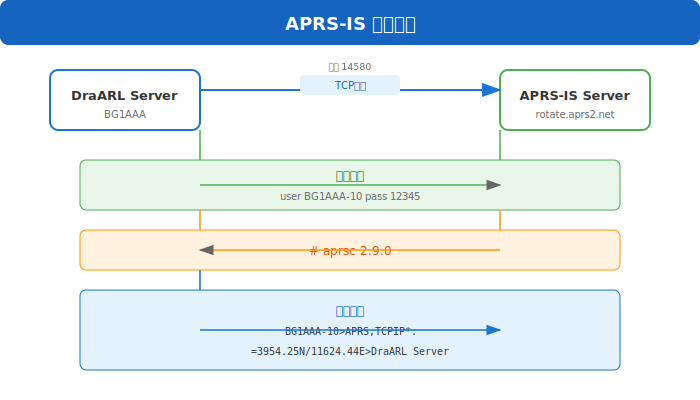

# APRS 与位置服务

## 概述

DraARL 集成了 APRS（Automatic Packet Reporting System）协议支持，设备可通过心跳包上报 GPS 位置信息，服务器可将位置信息转发到 APRS-IS 网络。

## APRS 配置

### 站点配置

管理员可在后台站点配置中设置 APRS 参数。

**配置项**:

| 配置键 | 说明 | 示例 |
|--------|------|------|
| aprs_enabled | 是否启用APRS | true |
| aprs_server | APRS-IS服务器地址 | rotate.aprs2.net |
| aprs_port | APRS-IS服务器端口 | 14580 |
| aprs_callsign | 本机呼号 | BG1AAA |
| aprs_ssid | SSID | 10 |
| aprs_passcode | APRS密码 | 12345 |
| aprs_latitude | 纬度 | 39.9042 |
| aprs_longitude | 经度 | 116.4074 |
| aprs_altitude | 海拔(米) | 50 |
| aprs_symbol | APRS符号表 | / |
| aprs_symbol_code | 笔号代码 | > |
| aprs_comment | 注释 | DraARL Server |

### APRS 密码生成

APRS-IS 使用呼号生成的密码进行验证。密码生成算法：

```go
func GenerateAPRSPasscode(callsign string) int {
    // 移除SSID部分
    callsign = strings.Split(callsign, "-")[0]
    callsign = strings.ToUpper(callsign)
    
    hash := 0x73C2
    for i := 0; i < len(callsign); i += 2 {
        hash ^= int(callsign[i]) << 8
        if i+1 < len(callsign) {
            hash ^= int(callsign[i+1])
        }
    }
    return hash & 0x7FFF
}
```

## 设备位置上报

### 心跳包 GPS 数据

设备可在心跳包（Type=2）的 DATA 区域携带 GPS 位置信息。

**DATA 格式**:

```
+--------+--------+--------+--------+
| 0-7    | 8-15   | 16-23  | 24+    |
| Lat    | Lon    | Alt    | Extra  |
| 8B     | 8B     | 8B     | 变长   |
+--------+--------+--------+--------+
```

| 偏移 | 长度 | 字段名 | 类型 | 说明 |
|------|------|--------|------|------|
| 0 | 8B | Latitude | float64 BE | 纬度（正=北，负=南） |
| 8 | 8B | Longitude | float64 BE | 经度（正=东，负=西） |
| 16 | 8B | Altitude | float64 BE | 海拔高度（米） |
| 24 | 变长 | Extra | ASCII | 可选扩展（如MAC地址） |

### 示例

**携带 GPS 的心跳包**:

```
Header (90 bytes):
  Version: "DraA"
  Type: 2 (Heartbeat)
  Username: "user1"
  DMRID: 460001

DATA (24 bytes):
  Lat:  39.9042 (0x4043E1A800000000)
  Lon: 116.4074 (0x405D086666666666)
  Alt: 50.0     (0x4049000000000000)
```

**携带 GPS 和 MAC 的心跳包**:

```
DATA (47 bytes):
  Lat:  39.9042 (8 bytes)
  Lon: 116.4074 (8 bytes)
  Alt: 50.0     (8 bytes)
  MAC: "AA:BB:CC:DD:EE:FF" (23 bytes ASCII)
```

### 位置更新频率

- 设备应在心跳包中携带位置信息
- 建议心跳间隔：30-60秒
- 位置变化较大时可增加频率

## 位置存储与查询

### 设备位置存储

服务器接收到携带 GPS 的心跳包后，会将位置信息存储在内存中，可通过 API 查询。

**查询设备位置**:

```http
GET /api/device/qths
Authorization: Bearer <token>
```

**响应**:
```json
{
  "code": 200,
  "data": [
    {
      "device_id": 1,
      "device_name": "ESP32-001",
      "username": "user1",
      "callsign": "BG1AAA",
      "latitude": 39.9042,
      "longitude": 116.4074,
      "altitude": 50.0,
      "last_update": "2026-05-30 12:00:00"
    }
  ]
}
```

### IP 地理位置

对于没有 GPS 的设备，服务器可通过 IP 地址查询地理位置（使用 ipdb）。

**配置**:

```yaml
System:
    IPfile: ./udphub.ipdb  # IP地址库文件路径
```

**查询结果**:

```json
{
  "ip": "116.4074",
  "country": "中国",
  "province": "北京",
  "city": "北京",
  "isp": "联通"
}
```

## APRS-IS 集成

### APRS-IS 连接

服务器作为 APRS 客户端连接到 APRS-IS 网络，将设备位置信息上报。

**连接流程**:



### APRS 位置格式

APRS 使用特殊的坐标格式：

**纬度格式**: `DDMM.MMN`
- DD: 度（00-90）
- MM.MM: 分（00.00-59.99）
- N/S: 北纬/南纬

**经度格式**: `DDDMM.MME`
- DDD: 度（000-180）
- MM.MM: 分（00.00-59.99）
- E/W: 东经/西经

**转换示例**:

```go
func DecimalToAPRSLat(lat float64) string {
    ns := "N"
    if lat < 0 {
        ns = "S"
        lat = -lat
    }
    deg := int(lat)
    min := (lat - float64(deg)) * 60
    return fmt.Sprintf("%02d%05.2f%s", deg, min, ns)
}

func DecimalToAPRSLon(lon float64) string {
    ew := "E"
    if lon < 0 {
        ew = "W"
        lon = -lon
    }
    deg := int(lon)
    min := (lon - float64(deg)) * 60
    return fmt.Sprintf("%03d%05.2f%s", deg, min, ew)
}
```

### APRS 消息格式

**位置报告**:

```
BG1AAA-10>APRS,TCPIP*:!3954.25N/11624.44E>DraARL Server
```

**带时间的位置报告**:

```
BG1AAA-10>APRS,TCPIP*:=@120000h3954.25N/11624.44E>DraARL Server
```

**带气象数据的位置报告**:

```
BG1AAA-10>APRS,TCPIP*:!3954.25N/11624.44E>..._.../...g...t050
```

## APRS.TV 集成

### 服务器发现

DraARL 支持 APRS.TV 平台的服务器发现功能，可自动发现其他 DraARL 服务器。

**发现流程**:

1. 连接 APRS.TV 服务器
2. 发送发现请求
3. 接收其他服务器列表
4. 存储到数据库

**服务器列表**:

```json
{
  "servers": [
    {
      "name": "DraARL-Server-2",
      "ip": "203.0.113.1",
      "udp_port": 60050,
      "web_port": 9002,
      "callsign": "BG2BBB"
    }
  ]
}
```

## 前端位置展示

### 地图展示

前端可使用地图组件展示设备位置：

```jsx
import { MapContainer, TileLayer, Marker, Popup } from 'react-leaflet';

function DeviceMap({ devices }) {
  return (
    <MapContainer center={[39.9042, 116.4074]} zoom={10}>
      <TileLayer url="https://{s}.tile.openstreetmap.org/{z}/{x}/{y}.png" />
      {devices.map(device => (
        <Marker key={device.id} position={[device.latitude, device.longitude]}>
          <Popup>
            <h3>{device.callsign}</h3>
            <p>{device.device_name}</p>
            <p>海拔: {device.altitude}m</p>
          </Popup>
        </Marker>
      ))}
    </MapContainer>
  );
}
```

### 位置历史

可查询设备的历史位置记录：

```http
GET /api/devices/:id/location-history?start=2026-05-01&end=2026-05-30
Authorization: Bearer <token>
```

## 安全与隐私

### 位置隐私

1. **用户授权**: 设备位置上报需要用户明确启用
2. **数据脱敏**: 公开接口不暴露精确坐标
3. **访问控制**: 只有设备所有者和管理员可查看精确位置
4. **数据保留**: 位置数据保留时间可配置

### APRS 安全

1. **呼号验证**: APRS-IS 使用呼号+密码验证
2. **频率限制**: 防止位置信息洪水
3. **数据过滤**: 过滤无效坐标

## 故障排除

### 常见问题

| 问题 | 原因 | 解决方案 |
|------|------|----------|
| APRS连接失败 | 密码错误 | 检查passcode计算 |
| 位置不上报 | 设备未启用GPS | 检查设备配置 |
| 坐标偏移 | 坐标系不一致 | WGS-84坐标系 |
| 位置延迟 | 心跳间隔过长 | 调整心跳频率 |

### 日志查看

APRS 连接日志：

```
[APRS] Connecting to rotate.aprs2.net:14580...
[APRS] Login successful: BG1AAA-10
[APRS] Position reported: 39.9042, 116.4074
[APRS] Connection lost, reconnecting...
```

## 相关API汇总

| 方法 | 路径 | 权限 | 说明 |
|------|------|------|------|
| GET | `/api/device/qths` | JWT+Approved | 查询设备位置列表 |
| GET | `/api/config/aprs` | Admin | 获取APRS配置 |
| PUT | `/api/config/aprs` | Admin | 更新APRS配置 |
| GET | `/api/config/aprs/logs` | Admin | 获取APRS日志 |
| GET | `/api/public/relays` | Public | 查询公开中继台 |
