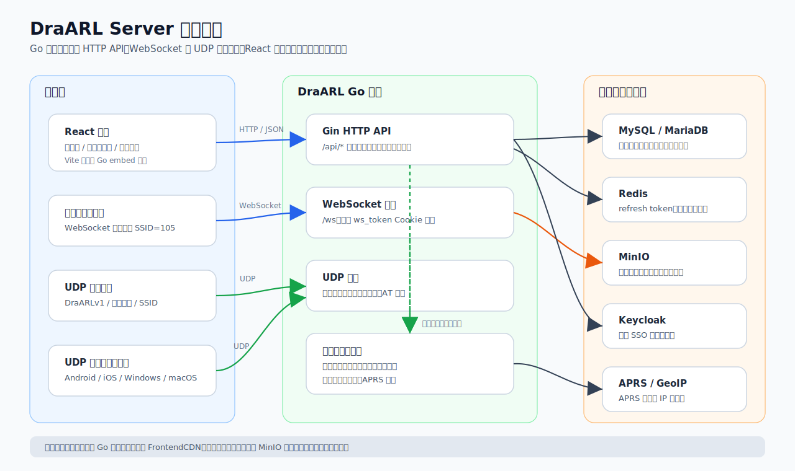

# 使用与说明文档总览

> 本组文档面向平台管理员、普通用户、设备接入开发者和运维人员，基于当前本地代码整理。实际页面截图暂用占位；架构图、权限图、设备绑定流程图、运行态通信流程图已作为静态 SVG 生成并嵌入。

## 文档目录

1. [部署与配置](./01-部署与配置.md)
2. [账号、登录与权限](./02-账号登录与权限.md)
3. [用户控制台](./03-用户控制台.md)
4. [设备与群组](./04-设备与群组.md)
5. [在线收发、通信记录与通联日志](./05-在线收发与通信记录.md)
6. [管理员后台](./06-管理员后台.md)
7. [设备接入与 API 快速对接](./07-设备接入与API快速对接.md)
8. [运维与排障](./08-运维与排障.md)

详细 API 参数、请求体和响应示例请继续参考 [API 文档总览](../api/README.md)。

## 系统定位

DraARL Server 是一个面向业余无线电场景的实时通信与管理平台。后端使用 Go + Gin + GORM，提供 HTTP API、WebSocket 在线收发和 UDP DraARLv1 设备接入；前端使用 React + TypeScript + Vite + Material UI，提供公共页面、用户控制台和管理员后台。

核心能力包括：

- 实时语音转发：UDP 普通设备、UDP 幽灵设备和 WebSocket 浏览器幽灵设备可在群组内通信。
- 设备管理：支持设备绑定、设备配置同步、设备级禁发/禁收、固件发布。
- 用户和审核：支持账号密码、邮箱验证码、Keycloak SSO、注册审核、操作证审核。
- 群组与互联：支持公开群组、私有群组和虚拟互联组。
- 在线收发：浏览器通过 `/ws` 建立 WebSocket 幽灵设备，支持 PTT 语音和文本消息。
- 通信记录与通联日志：支持平台发信记录、通信趋势、音频存储和 HAM 通联日志。
- 资源与站点配置：支持资源中心、下载中心、Logo/Favicon、APRS、SMTP、OpenAI、通信记录策略。

## 总体架构

## 文档约定

- “截图占位”表示需要从实际运行页面补充的截图。
- “相关 API”表格列出当前功能常用接口；完整字段以 [API 文档](../api/README.md) 为准。
- `JWT` 表示需要 `Authorization: Bearer <access_token>`。
- `JWT + Approved` 表示需要登录且账号审核通过；管理员通常可绕过审核限制。
- `Admin` 表示管理员专用。

## 主要入口

| 类型 | 路径 | 说明 |
|---|---|---|
| 公共首页 | `/` | 首页、登录、注册入口。 |
| 登录 | `/login` | 密码登录、验证码登录、SSO 登录。 |
| 注册 | `/register` | 邮箱验证码注册，注册后等待审核。 |
| 用户仪表盘 | `/dashboard` | 当前用户统计、审核状态和系统信息。 |
| 设备管理 | `/devices` | 普通用户设备列表、配置、群组切换。 |
| 群组管理 | `/groups` | 公开/私有群组查看、加入、创建和管理。 |
| 在线收发 | `/radio` | 浏览器 PTT、文本消息和群组切换。 |
| 通信记录 | `/comm-records/platform` | 平台发信记录。 |
| 通联日志 | `/comm-records/logbook` | HAM 通联日志。 |
| 管理后台 | `/admin` | 管理员后台。 |

## 代码来源

本文档主要依据以下文件整理：

- `cmd/udphub/main.go`
- `internal/server/server.go`
- `internal/server/frontend_embed.go`
- `internal/config/config.go`
- `internal/gormdb/models.go`
- `internal/protocol/draarl.go`
- `www/src/App.tsx`
- `www/src/components/layout/*`
- `www/src/pages/*`
- `www/src/services/*`
