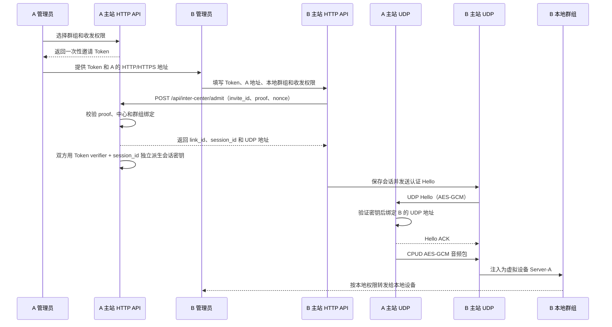

# 多中心群组互联

本文是 `dev` 分支中心到中心互联的现行设计和运行说明。两个主站各自管理本地用户、设备、群组和权限，只在管理员明确建立的群组映射上交换实时音频。

## 1. 当前运行模型

每个主站只有两个对外服务端口：

- Web/API HTTP 端口：承载后台、普通 API 和中心互联的低频邀请准入。生产环境可以由反向代理提供 HTTPS。
- `System.Port` 主 UDP 端口：承载普通设备流量和中心互联音频，中心互联不再单独监听 TLS/TCP 或 UDP 端口。

`dev` 不启动旧 Type 0 TLS 控制面，也不读取旧的节点控制面配置。无数据库的旧边缘运行时保留在 `edge` 分支；`dev` 的中心互联不能接受旧边缘节点连接。

## 2. 业务边界

A、B 两个主站的数据库和用户系统完全独立：

- 用户、设备、群组、密码、JWT 和管理员权限不跨站同步。
- A 的群组 ID 与 B 的群组 ID 可以不同，也不需要建立全局群组表。
- 音频转发必须同时经过两端的本地权限判断。
- 远端音频进入本地群组后使用虚拟服务器设备显示，例如 `Server-A`，不解析或伪造远端呼号。

连接存在发起方和接收方。发起方负责生成邀请并绑定自己的群组策略，接收方负责选择本地群组和本地收发权限。连接角色只描述准入流程，不代表管理权限或数据所有权。

```text
A 主站 group-12                         B 主站 group-38
本地设备 ──▶ [A→B 互联映射] ──UDP──▶ [虚拟设备 Server-A] ──▶ 本地设备
```



## 3. 邀请和准入流程

### 3.1 A 生成邀请

管理员在“群组管理 → 中心互联”选择 A 的本地群组、收发开关和虚拟设备名称，调用：

```text
POST /api/inter-center-links/invites
```

服务端生成带邀请 ID 的高熵 Token，只保存 Token secret 的 SHA-256 摘要，并按 `Interconnect.RegistrationTokenTTL` 写入过期时间。Token 格式为 `invite_id.secret`：邀请 ID 便于寻址数据库记录，secret 仍是唯一的准入秘密；明文 Token 只在创建响应中返回一次。过期邀请在 HTTP 准入时拒绝。

### 3.2 B 导入邀请

B 管理员填写 Token、A 的 HTTP/HTTPS 地址、B 的本地群组和 B 侧收发开关，调用：

```text
POST /api/inter-center-links/import
```

B 服务端从 Token 中解析邀请 ID，在本地计算 secret 的 SHA-256 verifier，再生成一次性 nonce 和 HMAC proof，向 A 请求：

```text
POST /api/inter-center/admit
```

请求体只含 `invite_id`、`token_proof`、`client_nonce`、对端中心、本地群组和收发权限；proof 是绑定这些字段的 `HMAC-SHA256(verifier, transcript)`。原始 Token secret 不会从 B 发送到 A，A 只用数据库里的 verifier 校验 proof。请求使用现有 HTTP 服务，不建立专用 TLS 控制连接。服务端限制请求体、响应体、超时和重定向，并按源 IP 限制准入频率。A 只允许邀请绑定一个对端中心和一个对端群组；同一对端重试可以恢复原会话，换中心或换群组会被拒绝。

准入完成后，两端都只保存自己的 `token → local_group_id` 映射。管理员浏览器只提交当前站点自己的 `local_group_id`：A 在生成邀请时提交 A 的群组，B 在导入邀请时提交 B 的群组。相同的互联标识随加密数据到达对端，对端用自己的本地映射决定注入哪个群组；管理列表和修改接口不返回、也不接受对端群组 ID。任一侧切换本地群组时，只需修改本地映射，另一侧无需感知或重新配置。

准入响应只返回随机会话 ID、对端中心身份、策略摘要和 UDP 地址，不返回会话密钥。响应中的链路 ID、会话 ID、中心身份、群组、收发策略、UDP 地址和虚拟设备名还会使用同一 verifier 生成 `admission_proof`，B 在落库和启动 UDP 会话前必须校验它，防止普通 HTTP 链路上的中间人篡改响应。两端使用相同的 `HKDF-SHA256(Token verifier, session_id)` 独立派生 32 字节 AES-GCM 会话密钥，并只保存服务端加密后的密钥副本。这样即使 HTTP 反向代理或访问日志记录了响应，也不会得到可直接注入 UDP 的会话密钥。生产部署仍应让管理 HTTP 经过 HTTPS，以保护邀请提交、中心身份和准入元数据的机密性；响应 HMAC 负责完整性校验，不能替代 HTTPS 的保密性。

## 4. UDP 音频数据面

B 使用准入返回的会话信息，向 A 的主 UDP 地址发送认证 Hello。A 仅在 Hello 通过 AES-GCM 验证后学习 B 的真实 UDP 源地址；地址变化必须再次通过认证，未认证的报文不能重绑定会话。

双方随后在 `System.Port` 上交换 `CPUD` 数据报。每个数据报使用会话密钥保护，并包含版本、会话 ID、单调序列号、时间戳、互联 ID、目标群组和媒体类型。接收端检查：

- 会话密钥和 AES-GCM 标签；
- 会话 ID、来源中心、互联 ID 和方向；
- 已绑定的 UDP 地址；
- 序列号、时间窗口和重放窗口；
- 群组映射、启用状态和本地半双工占用；
- 单连接速率、队列长度和数据包大小。

当前只传输 Opus 音频。原始邀请 Token 和 HTTP proof 都不进入 UDP 包；CPUD 只携带随机 session ID、序列号和 AES-GCM 认证密文。接收端先用 session ID 找到本地会话，再校验 GCM、时间窗和重放序号，随后按本地群组映射注入。它不进入 Type 0 控制包；`dev` 不启用旧 Type 0/TLS 控制面。文本、广播、多级转发和自动 NAT 打洞不属于当前协议。

## 5. 收发权限

每个方向取两端权限的交集：

```text
A → B = A.send_audio && B.receive_audio
B → A = B.send_audio && A.receive_audio
```

任意一端停用互联或关闭对应开关，运行时立即停止该方向的数据发送和注入。任意一端切换自己的本地群组不会改变另一端的映射。远端不能通过 Token 扩大本地权限，也不能调用本地用户、设备或管理员 API。

## 6. 虚拟设备和记录

远端来源在本地主站表现为系统虚拟设备：

```text
source_type      = intercenter
source_center_id = 远端中心 ID
link_id          = 互联对象 ID
virtual_device   = Server-A
local_group_id   = 本地群组 ID
remote_group_id  = 不作为本地配置；若握手携带，仅用于运行时一致性检查
user_id          = null
device_id        = null 或系统虚拟设备 ID
```

同一互联重连后仍使用同一个虚拟设备身份。通信记录和后台统计可以记录收包、发包、字节数、丢弃、校验失败、重放、最后错误和最后活动时间，但不得把远端音频归因给本地用户。

## 7. 接入点发现

`GET /api/access-points` 只用于设备发现，不建立中心互联，也不返回互联 Token 或远端中心信息。

当前每个主站最多返回一个自己的中心接入点，包括公网 UDP 地址和端口。接口保留为后续动态端口和多个收发器扩展的稳定入口；多接入点能力暂不加入 `dev`。

## 8. 配置边界

中心配置只保留以下互联设置：

```yaml
Interconnect:
  Enabled: false
  CenterID: "center-a"
  RegistrationTokenTTL: 86400
  CredentialRotationGraceSeconds: 600
  SessionRecoveryWindowSeconds: 180
  Resources: {}
```

`ControlListen`、TLS 证书文件、客户端 CA、自签名开关和 `NodeTokens` 已从中心配置模型删除。它们不再被 `dev` 解析、展示或启动时读取。`edge` 分支的独立配置只对该分支有效，不属于中心配置。

## 9. 运行时恢复和失败处理

中心启动时会从数据库恢复已准入的中心互联会话。对端必须用新的认证 Hello 恢复 UDP 地址绑定；恢复失败时不会接受旧地址或旧数据包。实时音频不建立无限离线队列，断线期间的帧直接丢弃并计入运行时统计。

准入接口和 UDP 会话均采用有界资源：请求体、响应体、超时、源 IP 速率、包速率、队列长度和重放窗口都有上限。互联 ID、来源中心和消息来源用于防止 A→B→A 循环和重复注入。

## 10. 分支边界

- `dev`：中心主站、HTTP 邀请准入、共享 UDP 音频、群组映射、虚拟服务器设备和接入点发现。
- `edge`：旧的无数据库边缘运行时及其 Type 0/TLS 节点控制能力，作为独立兼容分支保留。

中心到中心互联不依赖 `edge` 分支。未来若重新启用边缘部署，应在 `edge` 分支维护其配置和文档，不把旧字段重新加入 `dev`。

## 11. 后续范围

后续可以在现有模型上增加双向群组映射、动态 UDP 端口、多个收发器和跨中心通信统计。任何扩展都应保持两个主站的用户和权限边界，不把中心互联演变为跨站统一登录或完整路由同步。
