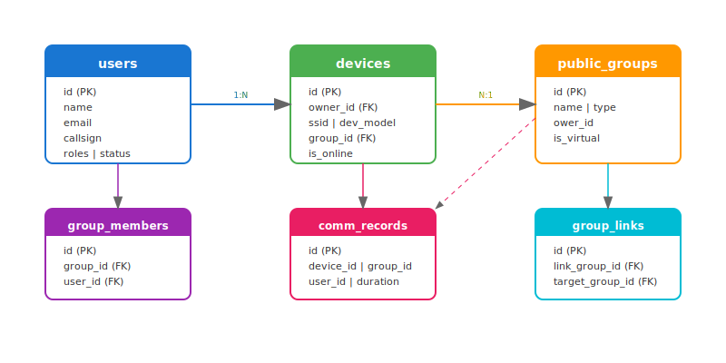

# 数据字典

## 概述

本文档详细描述 DraARL 数据库的所有表结构、字段定义和索引信息。

数据库类型：MySQL 5.7+ / MariaDB 10.3+

字符集：`utf8mb4`

排序规则：`utf8mb4_unicode_ci`

---

## 用户表 (users)

用户表存储所有注册用户的信息。

### 字段定义

| 字段名 | 类型 | 可空 | 默认值 | 说明 |
|--------|------|------|--------|------|
| id | INT | NO | AUTO_INCREMENT | 主键 |
| name | VARCHAR(255) | NO | - | 用户名（唯一） |
| email | VARCHAR(255) | NO | - | 邮箱地址（唯一） |
| email_verified | TINYINT(1) | NO | 0 | 邮箱是否已验证 |
| callsign | VARCHAR(32) | YES | NULL | 业余电台呼号（唯一） |
| gird | VARCHAR(255) | YES | - | 网格定位（遗留字段） |
| phone | VARCHAR(32) | YES | - | 手机号 |
| password | VARCHAR(255) | NO | - | 密码（bcrypt哈希） |
| birthday | VARCHAR(32) | YES | - | 生日 |
| sex | TINYINT | NO | 0 | 性别（0=未知, 1=男, 2=女） |
| avatar | VARCHAR(512) | YES | - | 头像URL |
| address | VARCHAR(512) | YES | - | 地址 |
| roles | VARCHAR(32) | NO | 'user' | 角色（user/admin） |
| introduction | TEXT | YES | - | 个人简介 |
| alarm_msg | TINYINT(1) | NO | 0 | 是否接收告警消息 |
| status | TINYINT | NO | 1 | 账号状态 |
| approval_status | TINYINT | NO | 0 | 审核状态（0=待审核, 1=已通过, 2=已拒绝） |
| reviewer_id | INT | YES | NULL | 审核人ID |
| review_note | TEXT | YES | - | 审核备注 |
| review_time | DATETIME | YES | NULL | 审核时间 |
| update_time | DATETIME | NO | CURRENT_TIMESTAMP | 更新时间（自动） |
| last_login_time | DATETIME | YES | NULL | 最后登录时间 |
| login_err_times | INT | NO | 0 | 登录错误次数 |
| create_time | DATETIME | NO | CURRENT_TIMESTAMP | 创建时间（自动） |
| openid | VARCHAR(255) | YES | - | 微信OpenID |
| nickname | VARCHAR(255) | YES | - | 昵称 |
| pid | VARCHAR(255) | YES | - | PID标识 |
| last_login_ip | VARCHAR(64) | YES | - | 最后登录IP |
| dmrid | INT | NO | 0 | DMR ID |
| mdcid | VARCHAR(255) | NO | '' | MDC ID |
| device_password | VARCHAR(255) | YES | - | 设备准入密码（AES可逆密文） |

### 索引

| 索引名 | 类型 | 字段 | 说明 |
|--------|------|------|------|
| PRIMARY | 主键 | id | 主键索引 |
| uk_name | 唯一 | name | 用户名唯一 |
| uk_email | 唯一 | email | 邮箱唯一 |
| uk_callsign | 唯一 | callsign | 呼号唯一 |
| idx_phone | 普通 | phone | 手机号索引 |
| idx_openid | 普通 | openid | 微信OpenID索引 |

### 外键关系

被以下表引用（级联删除）：
- devices.owner_id
- group_members.user_id
- operator_certs.user_id
- logbooks.user_id
- user_radio_presets.user_id
- user_device_preferences.user_id

---

## 设备表 (devices)

设备表存储所有注册设备的信息。

### 字段定义

| 字段名 | 类型 | 可空 | 默认值 | 说明 |
|--------|------|------|--------|------|
| id | INT | NO | AUTO_INCREMENT | 主键 |
| name | VARCHAR(255) | YES | - | 设备名称 |
| dmrid | BIGINT | YES | - | DMR ID |
| ssid | TINYINT UNSIGNED | NO | - | 设备子号 |
| owner_id | INT | NO | - | 所有者用户ID |
| qth | VARCHAR(255) | YES | - | 位置信息 |
| last_online_ip | VARCHAR(64) | YES | - | 最近上线IP |
| dev_model | INT | NO | 0 | 设备型号 |
| group_id | INT | YES | NULL | 所属群组ID |
| status | TINYINT | NO | 1 | 设备状态 |
| is_certed | TINYINT(1) | NO | 0 | 是否已认证 |
| priority | INT | NO | 100 | 优先级 |
| disable_send | TINYINT(1) | NO | 0 | 设备级禁发 |
| disable_recv | TINYINT(1) | NO | 0 | 设备级禁收 |
| is_online | TINYINT(1) | NO | 0 | 是否在线 |
| online_time | DATETIME | YES | - | 上线时间 |
| note | TEXT | YES | - | 备注 |
| create_time | DATETIME | NO | CURRENT_TIMESTAMP | 创建时间 |
| update_time | DATETIME | NO | CURRENT_TIMESTAMP | 更新时间 |

### 索引

| 索引名 | 类型 | 字段 | 说明 |
|--------|------|------|------|
| PRIMARY | 主键 | id | 主键索引 |
| idx_owner_ssid | 唯一 | owner_id, ssid | 用户下SSID唯一 |
| idx_dmrid | 普通 | dmrid | DMR ID索引 |
| idx_group_id | 普通 | group_id | 群组ID索引 |
| idx_group_online | 普通 | group_id, is_online | 群组在线设备索引 |

### 外键关系

- owner_id → users.id (CASCADE)
- group_id → public_groups.id (SET NULL)

### 设备型号枚举

| 值 | 说明 |
|----|------|
| 0 | 未知设备 |
| 1 | ESP32 链路盒子（1W 射频版） |
| 2 | ESP32 链路盒子（无射频版） |
| 100 | 微信小程序 |
| 101 | Android 客户端 |
| 102 | iOS 客户端 |
| 103 | Windows 客户端 |
| 104 | macOS 客户端 |
| 105 | 浏览器客户端 |
| 106 | 互联设备（历史） |
| 107 | ESP32 链路台/手咪（历史） |
| 236 | 南山对讲软件桥接器 |
| 237 | 涛涛对讲软件桥接器 |
| 238 | 本视对讲（HT）软件桥接器 |
| 239 | NRL2 系统软件桥接器 |

---

## 群组表 (public_groups)

群组表存储所有群组的信息。

### 字段定义

| 字段名 | 类型 | 可空 | 默认值 | 说明 |
|--------|------|------|--------|------|
| id | INT | NO | AUTO_INCREMENT | 主键 |
| name | VARCHAR(255) | NO | - | 群组名称 |
| type | INT | NO | 0 | 类型（0=普通, 1=公开, 2=私有） |
| call_sign | VARCHAR(255) | YES | - | 群组呼号 |
| password | VARCHAR(255) | YES | - | 私有群组密码 |
| allow_callsign_ssid | TEXT | YES | - | 允许的呼号SSID列表 |
| ower_id | INT | YES | - | 所有者用户ID |
| master_server | INT | YES | - | 主服务器ID |
| slave_server | INT | YES | - | 从服务器ID |
| status | INT | NO | 1 | 状态（1=启用） |
| is_virtual | TINYINT(1) | NO | 0 | 是否为虚拟互联组 |
| create_time | DATETIME | NO | CURRENT_TIMESTAMP | 创建时间 |
| update_time | DATETIME | NO | CURRENT_TIMESTAMP | 更新时间 |
| note | TEXT | YES | - | 备注 |

### 索引

| 索引名 | 类型 | 字段 | 说明 |
|--------|------|------|------|
| PRIMARY | 主键 | id | 主键索引 |
| idx_ower_id | 普通 | ower_id | 所有者索引 |

### 群组类型枚举

| 值 | 说明 |
|----|------|
| 0 | 普通群组 |
| 1 | 公开群组 |
| 2 | 私有群组 |

---

## 群组互联表 (group_links)

群组互联表存储虚拟互联组与目标群组的关联关系。

### 字段定义

| 字段名 | 类型 | 可空 | 默认值 | 说明 |
|--------|------|------|--------|------|
| id | INT | NO | AUTO_INCREMENT | 主键 |
| link_group_id | INT | NO | - | 互联组ID |
| target_group_id | INT | NO | - | 目标群组ID |
| created_at | DATETIME | NO | CURRENT_TIMESTAMP | 创建时间 |
| updated_at | DATETIME | NO | CURRENT_TIMESTAMP | 更新时间 |

### 索引

| 索引名 | 类型 | 字段 | 说明 |
|--------|------|------|------|
| PRIMARY | 主键 | id | 主键索引 |
| uk_link_target | 唯一 | link_group_id, target_group_id | 互联关系唯一 |

### 外键关系

- link_group_id → public_groups.id (CASCADE)
- target_group_id → public_groups.id (CASCADE)

---

## 群组成员表 (group_members)

群组成员表存储用户与群组的关联关系。

### 字段定义

| 字段名 | 类型 | 可空 | 默认值 | 说明 |
|--------|------|------|--------|------|
| id | INT | NO | AUTO_INCREMENT | 主键 |
| group_id | INT | NO | - | 群组ID |
| user_id | INT | NO | - | 用户ID |
| is_verified | TINYINT(1) | NO | 0 | 是否已验证密码 |
| join_time | DATETIME | YES | - | 加入时间 |
| last_verify | DATETIME | YES | - | 最后验证时间 |
| create_time | DATETIME | NO | CURRENT_TIMESTAMP | 创建时间 |
| update_time | DATETIME | NO | CURRENT_TIMESTAMP | 更新时间 |

### 索引

| 索引名 | 类型 | 字段 | 说明 |
|--------|------|------|------|
| PRIMARY | 主键 | id | 主键索引 |
| uk_group_user | 唯一 | group_id, user_id | 群组用户唯一 |

### 外键关系

- group_id → public_groups.id (CASCADE)
- user_id → users.id (CASCADE)

---

## 通信记录表 (comm_records)

通信记录表存储所有语音通信的记录。

### 字段定义

| 字段名 | 类型 | 可空 | 默认值 | 说明 |
|--------|------|------|--------|------|
| id | UINT | NO | AUTO_INCREMENT | 主键 |
| device_id | UINT | NO | 0 | 发送设备ID（0=幽灵设备） |
| device_ssid | TINYINT UNSIGNED | NO | 0 | 设备SSID |
| group_id | UINT | YES | NULL | 群组ID |
| user_id | UINT | YES | NULL | 用户ID |
| start_time | DATETIME | NO | - | 通信开始时间 |
| end_time | DATETIME | YES | - | 通信结束时间 |
| duration_ms | INT | NO | 0 | 通信时长（毫秒） |
| audio_path | VARCHAR(255) | YES | - | MinIO音频文件路径 |
| audio_size | BIGINT | NO | 0 | 音频文件大小（字节） |
| status | INT | NO | 0 | 状态（0=录制中, 1=待上传, 2=已完成, 3=上传失败） |
| created_at | DATETIME | NO | CURRENT_TIMESTAMP | 创建时间 |

### 索引

| 索引名 | 类型 | 字段 | 说明 |
|--------|------|------|------|
| PRIMARY | 主键 | id | 主键索引 |
| idx_device_id | 普通 | device_id | 设备ID索引 |
| idx_group_id | 普通 | group_id | 群组ID索引 |
| idx_user_id | 普通 | user_id | 用户ID索引 |
| idx_group_start | 普通 | group_id, start_time | 群组时间索引 |
| idx_user_start | 普通 | user_id, start_time | 用户时间索引 |
| idx_status | 普通 | status | 状态索引 |

---

## 服务器表 (servers)

服务器表存储服务器管理信息。

### 字段定义

| 字段名 | 类型 | 可空 | 默认值 | 说明 |
|--------|------|------|--------|------|
| id | INT | NO | AUTO_INCREMENT | 主键 |
| name | VARCHAR(255) | NO | - | 服务器名称 |
| server_type | INT | NO | 0 | 服务器类型 |
| join_key | VARCHAR(255) | YES | - | 加入密钥 |
| ip_addr | VARCHAR(64) | YES | - | IP地址 |
| udp_port | INT | YES | - | UDP端口 |
| ower_id | INT | YES | - | 所有者用户ID |
| is_online | TINYINT(1) | NO | 0 | 是否在线 |
| status | INT | NO | 1 | 状态 |
| create_time | DATETIME | NO | CURRENT_TIMESTAMP | 创建时间 |
| update_time | DATETIME | NO | CURRENT_TIMESTAMP | 更新时间 |
| note | TEXT | YES | - | 备注 |

---

## 中继台表 (relay)

中继台表存储中继台信息。

### 字段定义

| 字段名 | 类型 | 可空 | 默认值 | 说明 |
|--------|------|------|--------|------|
| id | INT | NO | AUTO_INCREMENT | 主键 |
| name | VARCHAR(255) | NO | - | 中继台名称 |
| up_freq | VARCHAR(32) | YES | - | 上行频率 |
| down_freq | VARCHAR(32) | YES | - | 下行频率 |
| send_ctss | VARCHAR(32) | YES | - | 发射亚音 |
| recive_ctss | VARCHAR(32) | YES | - | 接收亚音 |
| ower_callsign | VARCHAR(32) | YES | - | 所有者呼号 |
| location | VARCHAR(255) | YES | - | 位置 |
| latitude | DOUBLE | YES | - | 纬度 |
| longitude | DOUBLE | YES | - | 经度 |
| status | INT | NO | 1 | 状态 |
| create_time | DATETIME | NO | CURRENT_TIMESTAMP | 创建时间 |
| update_time | DATETIME | NO | CURRENT_TIMESTAMP | 更新时间 |
| note | TEXT | YES | - | 备注 |

---

## 操作日志表 (operator_log)

操作日志表记录系统操作日志。

### 字段定义

| 字段名 | 类型 | 可空 | 默认值 | 说明 |
|--------|------|------|--------|------|
| id | INT | NO | AUTO_INCREMENT | 主键 |
| timestamp | DATETIME | NO | CURRENT_TIMESTAMP | 时间戳 |
| content | TEXT | NO | - | 日志内容 |
| event_type | VARCHAR(64) | NO | - | 事件类型 |
| operator | VARCHAR(255) | YES | - | 操作者 |
| operator_id | INT | YES | - | 操作者ID |

### 索引

| 索引名 | 类型 | 字段 | 说明 |
|--------|------|------|------|
| PRIMARY | 主键 | id | 主键索引 |
| idx_event_type | 普通 | event_type | 事件类型索引 |
| idx_operator_id | 普通 | operator_id | 操作者索引 |

---

## 操作证表 (operator_certs)

操作证表存储用户提交的操作证信息。

### 字段定义

| 字段名 | 类型 | 可空 | 默认值 | 说明 |
|--------|------|------|--------|------|
| id | INT | NO | AUTO_INCREMENT | 主键 |
| user_id | INT | NO | - | 用户ID |
| callsign | VARCHAR(32) | NO | - | 申请呼号 |
| file_name | VARCHAR(255) | YES | - | 文件名 |
| minio_path | VARCHAR(512) | YES | - | MinIO路径 |
| status | INT | NO | 0 | 状态（0=待审, 1=通过, 2=拒绝） |
| reviewer_id | INT | YES | NULL | 审核人ID |
| review_note | TEXT | YES | - | 审核备注 |
| review_time | DATETIME | YES | NULL | 审核时间 |
| create_time | DATETIME | NO | CURRENT_TIMESTAMP | 创建时间 |
| update_time | DATETIME | NO | CURRENT_TIMESTAMP | 更新时间 |

### 外键关系

- user_id → users.id (CASCADE)
- reviewer_id → users.id (SET NULL)

---

## 站点配置表 (site_configs)

站点配置表存储系统配置项。

### 字段定义

| 字段名 | 类型 | 可空 | 默认值 | 说明 |
|--------|------|------|--------|------|
| id | INT | NO | AUTO_INCREMENT | 主键 |
| config_key | VARCHAR(255) | NO | - | 配置键（唯一） |
| config_value | TEXT | YES | - | 配置值 |
| category | VARCHAR(64) | NO | - | 分类（icp/system/aprs/openai/smtp） |
| description | VARCHAR(512) | YES | - | 描述 |

### 索引

| 索引名 | 类型 | 字段 | 说明 |
|--------|------|------|------|
| PRIMARY | 主键 | id | 主键索引 |
| uk_config_key | 唯一 | config_key | 配置键唯一 |
| idx_category | 普通 | category | 分类索引 |

### 配置分类

| 分类 | 说明 | 示例键 |
|------|------|--------|
| icp | ICP备案 | icp_number |
| system | 系统信息 | site_name, site_logo, site_favicon |
| aprs | APRS配置 | aprs_enabled, aprs_server, aprs_port |
| openai | AI配置 | openai_base_url, openai_api_key |
| smtp | 邮件配置 | smtp_host, smtp_port, smtp_password |
| registration | 注册配置 | require_email_verification |
| comm | 通信设置 | comm_record_enabled, comm_record_days |

---

## 资源文件表 (assets)

资源文件表存储资源中心的文件和文件夹。

### 字段定义

| 字段名 | 类型 | 可空 | 默认值 | 说明 |
|--------|------|------|--------|------|
| id | INT | NO | AUTO_INCREMENT | 主键 |
| parent_id | INT | YES | NULL | 父文件夹ID |
| name | VARCHAR(255) | NO | - | 名称 |
| type | VARCHAR(32) | NO | - | 类型（folder/file） |
| path | VARCHAR(512) | YES | - | MinIO路径 |
| size | BIGINT | NO | 0 | 文件大小 |
| mime_type | VARCHAR(128) | YES | - | MIME类型 |
| remark | TEXT | YES | - | 备注 |
| sort_order | INT | NO | 0 | 排序顺序 |
| create_time | DATETIME | NO | CURRENT_TIMESTAMP | 创建时间 |
| update_time | DATETIME | NO | CURRENT_TIMESTAMP | 更新时间 |

### 外键关系

- parent_id → assets.id (CASCADE)

---

## 设备配置表 (device_configs)

设备配置表存储设备的TLV配置数据。

### 字段定义

| 字段名 | 类型 | 可空 | 默认值 | 说明 |
|--------|------|------|--------|------|
| id | INT | NO | AUTO_INCREMENT | 主键 |
| device_id | INT | NO | - | 设备ID |
| config_key | VARCHAR(64) | NO | - | 配置键 |
| config_value | VARCHAR(255) | NO | - | 配置值 |
| create_time | DATETIME | NO | CURRENT_TIMESTAMP | 创建时间 |
| update_time | DATETIME | NO | CURRENT_TIMESTAMP | 更新时间 |

### 外键关系

- device_id → devices.id (CASCADE)

### 配置键说明

| 键 | 说明 | 示例值 |
|----|------|--------|
| rx_freq | 接收频率(Hz) | 439500000 |
| tx_freq | 发射频率(Hz) | 431500000 |
| rx_ctcss | 接收亚音(Hz) | 88.5 |
| tx_ctcss | 发射亚音(Hz) | 88.5 |
| sql_level | 静噪等级(0-8) | 5 |
| power_level | 功率等级 | 3 |
| tx_bandwidth | 发射带宽 | 2 |
| rx_tone_mode | 接收亚音类型 | CTCSS |
| rx_tone_value | 接收亚音值 | 88.5 |
| tx_tone_mode | 发射亚音类型 | CTCSS |
| tx_tone_value | 发射亚音值 | 88.5 |
| rf_guard_enabled | 射频保护开关 | 1 |
| rf_guard_single_tx_limit_s | 单次发射上限(秒) | 30 |
| rf_guard_window_s | 统计窗口(秒) | 300 |
| rf_guard_max_tx_in_window_s | 窗口内累计发射上限(秒) | 60 |

---

## 通联日志表 (logbooks)

通联日志表存储业余无线电QSO记录。

### 字段定义

| 字段名 | 类型 | 可空 | 默认值 | 说明 |
|--------|------|------|--------|------|
| id | INT | NO | AUTO_INCREMENT | 主键 |
| user_id | INT | NO | - | 用户ID |
| my_callsign | VARCHAR(32) | NO | - | 我方呼号 |
| time_utc | DATETIME | NO | - | UTC时间 |
| tx_frequency | VARCHAR(32) | YES | - | 发射频率 |
| rx_frequency | VARCHAR(32) | YES | - | 接收频率 |
| cq_zone | INT | YES | - | CQ分区 |
| itu_zone | INT | YES | - | ITU分区 |
| mode | VARCHAR(32) | YES | - | 通信模式 |
| callsign | VARCHAR(32) | NO | - | 对方呼号 |
| their_rst | VARCHAR(16) | YES | - | 对方信号报告 |
| my_rst | VARCHAR(16) | YES | - | 我方信号报告 |
| their_power | VARCHAR(16) | YES | - | 对方功率 |
| my_power | VARCHAR(16) | YES | - | 我方功率 |
| their_qth | VARCHAR(255) | YES | - | 对方QTH |
| my_qth | VARCHAR(255) | YES | - | 我方QTH |
| their_radio | VARCHAR(128) | YES | - | 对方电台 |
| my_radio | VARCHAR(128) | YES | - | 我方电台 |
| their_antenna | VARCHAR(128) | YES | - | 对方天线 |
| my_antenna | VARCHAR(128) | YES | - | 我方天线 |
| notes | TEXT | YES | - | 备注 |
| create_time | DATETIME | NO | CURRENT_TIMESTAMP | 创建时间 |
| update_time | DATETIME | NO | CURRENT_TIMESTAMP | 更新时间 |

### 外键关系

- user_id → users.id (CASCADE)

---

## 电台预设表 (user_radio_presets)

电台预设表存储用户常用的电台配置。

### 字段定义

| 字段名 | 类型 | 可空 | 默认值 | 说明 |
|--------|------|------|--------|------|
| id | INT | NO | AUTO_INCREMENT | 主键 |
| user_id | INT | NO | - | 用户ID |
| name | VARCHAR(128) | NO | - | 预设名称 |
| radio | VARCHAR(128) | YES | - | 电台型号 |
| antenna | VARCHAR(128) | YES | - | 天线型号 |
| power | VARCHAR(32) | YES | - | 功率 |
| qth | VARCHAR(255) | YES | - | QTH |
| sort_order | INT | NO | 0 | 排序顺序 |
| create_time | DATETIME | NO | CURRENT_TIMESTAMP | 创建时间 |
| update_time | DATETIME | NO | CURRENT_TIMESTAMP | 更新时间 |

### 外键关系

- user_id → users.id (CASCADE)

---

## 设备偏好表 (user_device_preferences)

设备偏好表存储用户的设备偏好设置。

### 字段定义

| 字段名 | 类型 | 可空 | 默认值 | 说明 |
|--------|------|------|--------|------|
| id | INT | NO | AUTO_INCREMENT | 主键 |
| user_id | INT | NO | - | 用户ID |
| dev_model | INT | NO | - | 设备型号 |
| last_group_id | INT | YES | - | 上次使用的群组ID |
| create_time | DATETIME | NO | CURRENT_TIMESTAMP | 创建时间 |
| update_time | DATETIME | NO | CURRENT_TIMESTAMP | 更新时间 |

### 外键关系

- user_id → users.id (CASCADE)

---

## 固件发布表 (firmware_releases)

固件发布表存储设备固件版本信息。

### 字段定义

| 字段名 | 类型 | 可空 | 默认值 | 说明 |
|--------|------|------|--------|------|
| id | INT | NO | AUTO_INCREMENT | 主键 |
| dev_model | INT | NO | - | 设备型号 |
| version | VARCHAR(32) | NO | - | 版本号（semver） |
| changelog | TEXT | YES | - | 更新日志 |
| file_name | VARCHAR(255) | NO | - | 文件名 |
| minio_path | VARCHAR(512) | NO | - | MinIO路径 |
| file_size | BIGINT | NO | 0 | 文件大小 |
| file_hash | VARCHAR(128) | NO | - | SHA-256哈希 |
| is_latest | TINYINT(1) | NO | 0 | 是否最新版本 |
| created_by | INT | YES | - | 上传者ID |
| created_at | DATETIME | NO | CURRENT_TIMESTAMP | 创建时间 |

---

## ER 关系图

