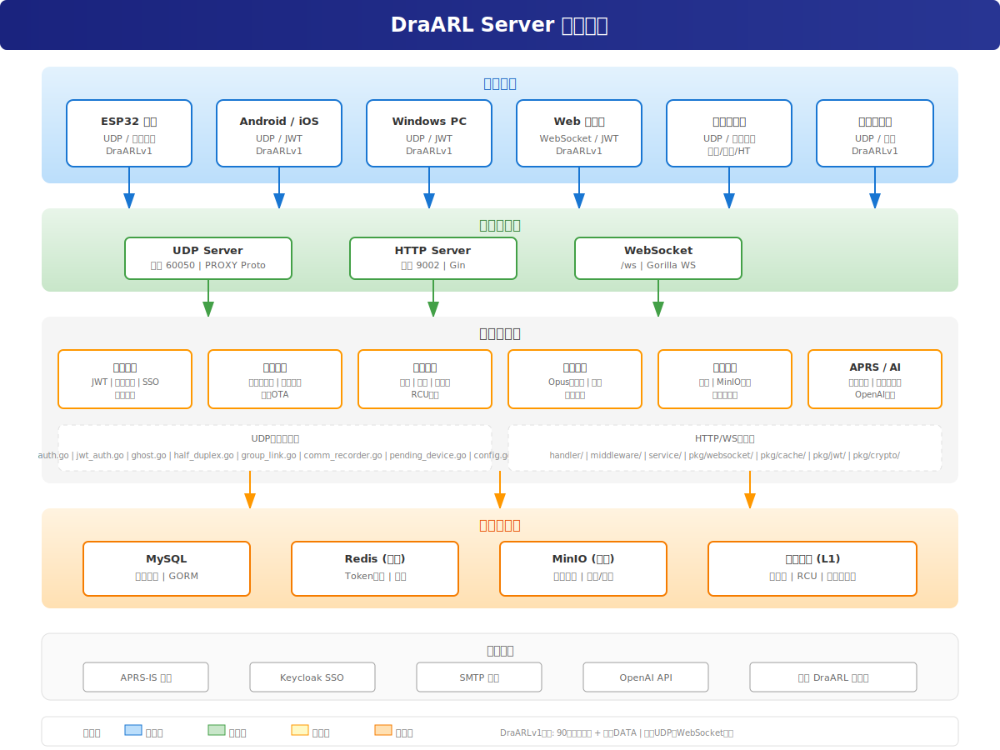
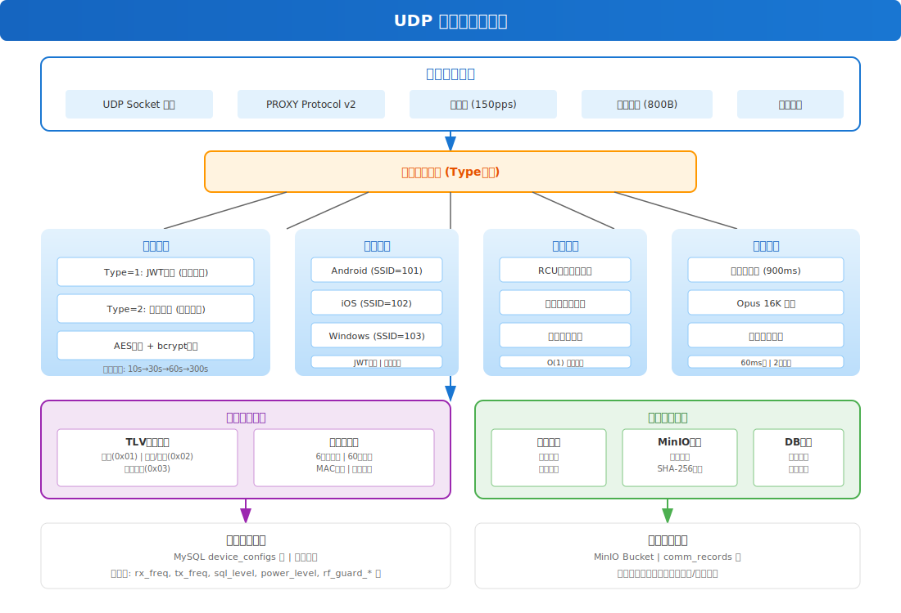
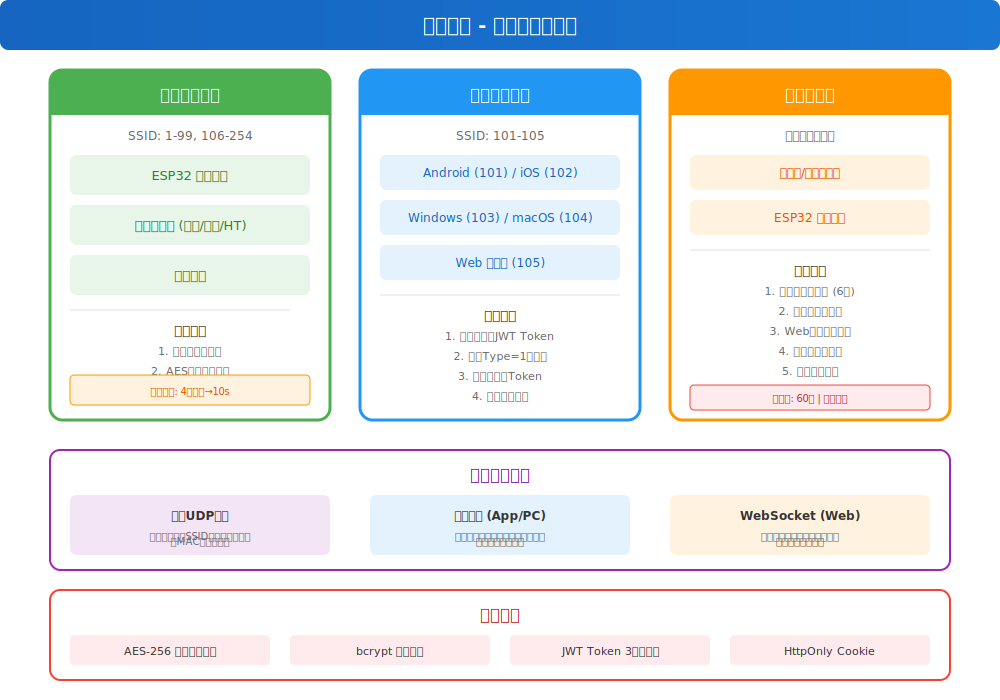
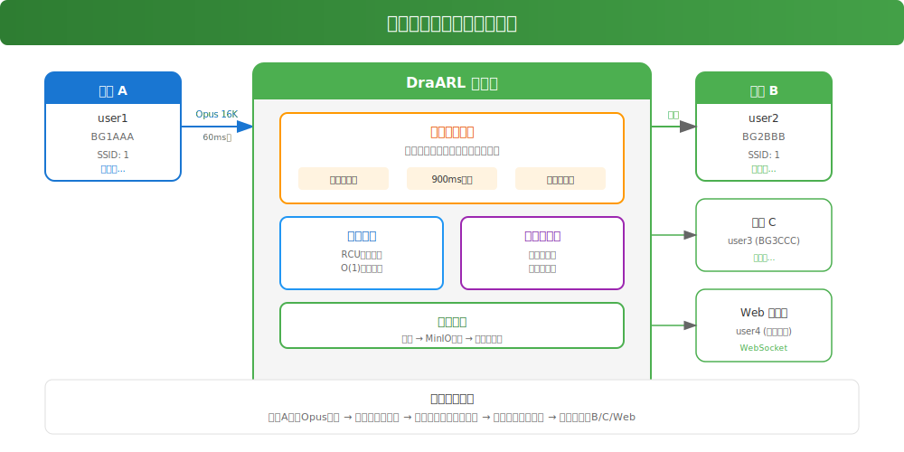
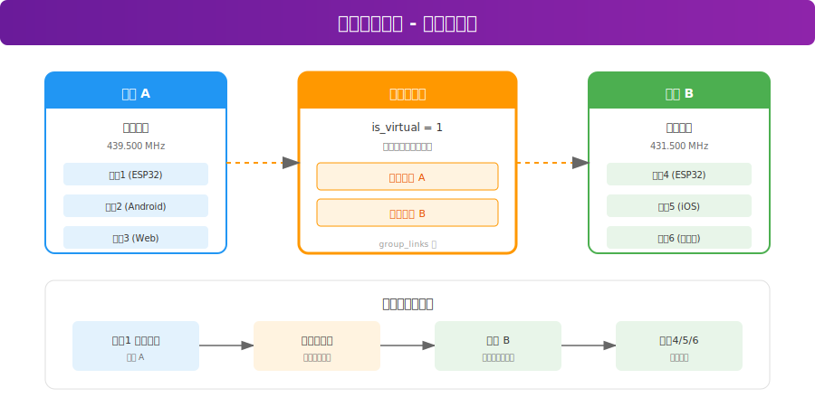
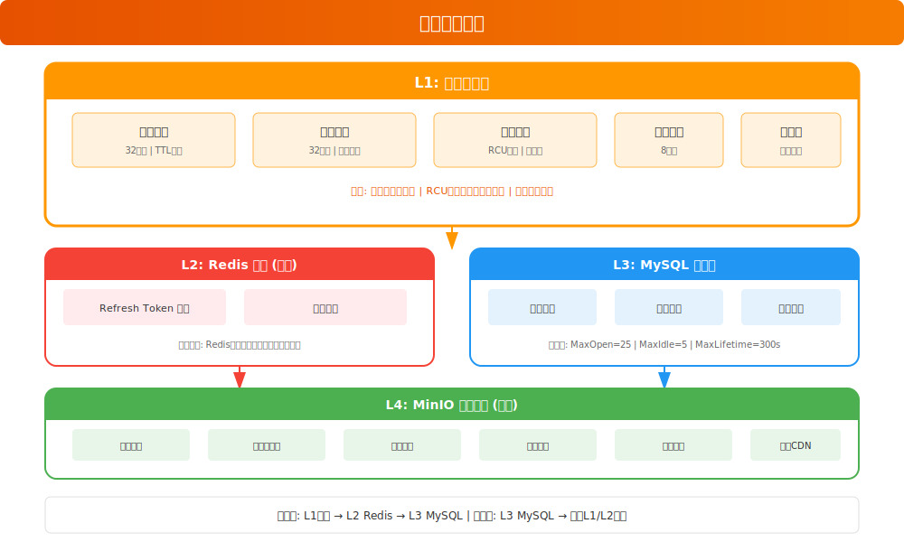

# 架构设计

## 系统概述

DraARL Server 是一个专业的数字无线电实时通信平台，采用前后端分离架构，核心是一个基于自研 DraARLv1 协议的 UDP 语音转发引擎。

## 整体架构

### 架构分层说明

| 层级 | 说明 |
|------|------|
| **客户端层** | 支持多种设备接入：ESP32硬件设备、Android/iOS移动客户端、Windows PC、Web浏览器、对讲桥接器 |
| **网络接入层** | UDP Server处理硬件设备通信，HTTP Server提供REST API，WebSocket处理浏览器实时通信 |
| **业务逻辑层** | 核心业务模块：认证、设备管理、群组管理、语音引擎、通信录制、APRS/AI服务 |
| **数据存储层** | MySQL主数据库、Redis Token存储、MinIO对象存储、内存多级缓存 |
| **外部服务** | APRS-IS网络、Keycloak SSO、SMTP邮件、OpenAI API、其他DraARL服务器 |

## UDP 服务器核心

UDP 服务器是系统的核心，负责处理所有 UDP 设备的通信。

### 核心模块说明

| 模块 | 文件 | 职责 |
|------|------|------|
| **数据包接收** | `server.go` | UDP数据包接收、限速器(150pps)、PROXY Protocol支持 |
| **设备认证** | `auth.go` | 设备密码认证(AES解密+bcrypt)、阶梯封禁(10s/30s/60s/300s) |
| **JWT认证** | `jwt_auth.go` | 幽灵设备JWT Token认证 |
| **幽灵设备** | `ghost.go` | UDP幽灵设备管理(Android/iOS/Windows/macOS) |
| **半双工仲裁** | `half_duplex.go` | 严格半双工：同一转发域同时只允许一个说话人，900ms超时 |
| **群组互联** | `group_link.go` | 虚拟互联组缓存，跨群组语音/文本转发 |
| **通信录制** | `comm_recorder.go` | 音频会话缓冲、MinIO批量上传、数据库同步 |
| **设备绑定** | `pending_device.go` | 6位动态码生成、MAC绑定、配置下发 |
| **配置同步** | `config.go` | TLV格式设备配置同步 |

## 认证架构

平台采用三轨制认证体系，根据设备类型自动选择认证方式。

### 认证方式对比

| 认证方式 | 适用设备 | SSID范围 | 认证凭证 | 说明 |
|----------|----------|----------|----------|------|
| **普通设备认证** | ESP32、桥接器 | 1-99, 106-254 | 设备密码 | AES加密存储，bcrypt验证 |
| **幽灵设备认证** | App/PC客户端 | 101-105 | JWT Token | 复用Web登录，无需预共享密钥 |
| **动态码绑定** | 新设备首次上线 | 1-99, 106-254 | 6位动态码 | 60秒有效期，单次使用 |

### 在线冲突处理

| 设备类型 | 冲突策略 | 说明 |
|----------|----------|------|
| 普通UDP设备 | 同用户同SSID只允许一台 | 同MAC可快速重连 |
| 幽灵设备(App/PC) | 同用户同平台只允许一个 | 新连接踢掉旧连接 |
| WebSocket(Web) | 同账号同平台只允许一个 | 互斥检查防止多开 |

## 语音转发架构

### 半双工仲裁机制

- **同一转发域内**，同一时刻只允许一个说话人
- **转发域计算**：通过BFS图遍历，计算群组和虚拟互联组的连通域
- **发言权获取**：设备发送语音包时，检查该转发域是否有人在说话
- **超时释放**：900ms无新语音包，自动释放发言权

### 语音转发流程

1. 设备A发送Opus语音包 (60ms帧)
2. 服务器认证检查
3. 半双工仲裁获取发言权
4. 群组路由查找目标设备
5. 转发到群组内所有在线设备
6. 如果有虚拟互联组，同时转发到关联群组

## 群组互联架构

### 虚拟互联组特性

- **自动转发**：语音/文本消息自动转发到所有关联的目标群组
- **多级互联**：支持A↔B↔C多级互联
- **防循环转发**：内置机制防止消息在互联组间循环
- **管理员配置**：仅管理员可创建和管理虚拟互联组

## 缓存架构

### 多级缓存策略

| 层级 | 存储 | 说明 |
|------|------|------|
| **L1** | 内存缓存 | 分片锁 + RCU模式，读无锁写时复制 |
| **L2** | Redis (可选) | Refresh Token存储，不可用时降级到内存 |
| **L3** | MySQL | 全量数据持久化 |
| **L4** | MinIO (可选) | 对象存储：头像、音频、固件、资源 |

### 缓存特点

- **分片锁**：32分片减少锁竞争
- **RCU模式**：群组缓存采用读无锁、写时复制
- **命中率监控**：实时统计缓存效果
- **自动过期**：TTL机制自动清理

## HTTP/WebSocket 服务器

基于 Gin 框架的 HTTP 服务器，提供 REST API 和 WebSocket 服务。

### 中间件层

| 中间件 | 说明 |
|--------|------|
| **CORS** | 跨域资源共享，Origin白名单 |
| **JWT** | Token认证，支持Header和Cookie |
| **Rate Limit** | 接口限流，防止滥用 |
| **Origin Check** | WebSocket来源检查 |

### 路由层

| 路径 | 说明 |
|------|------|
| `/api/*` | REST API接口 |
| `/ws` | WebSocket实时通信 |
| `/*` | 静态文件服务(嵌入模式) |

## 部署架构

### 单机部署

适用于小规模部署和开发测试：

- 单个Go二进制提供所有服务
- MySQL + Redis(可选) + MinIO(可选)
- 支持嵌入前端，单文件部署

### 分布式部署

适用于大规模部署和高可用要求：

- UDP Server独立部署，支持负载均衡
- HTTP/WS Server独立部署，支持多实例
- MySQL主从复制
- Redis集群
- MinIO分布式部署

## 技术栈总结

| 层级 | 技术 | 说明 |
|------|------|------|
| **前端** | React 19 + TypeScript + Vite 7 + MUI 7 | 现代化前端框架 |
| **HTTP框架** | Gin 1.12 | 高性能HTTP框架 |
| **ORM** | GORM 1.31 | 数据库ORM |
| **WebSocket** | Gorilla WebSocket | WebSocket支持 |
| **数据库** | MySQL 5.7+ / MariaDB 10.3+ | 主数据库 |
| **缓存** | Redis 6.0+ (可选) | Token存储 |
| **对象存储** | MinIO (可选) | 文件存储 |
| **认证** | JWT v5 + AES + bcrypt | 多种认证方式 |
| **音频编码** | Opus 16K | 语音编解码 |
| **协议** | DraARLv1 | 自研UDP协议 |
